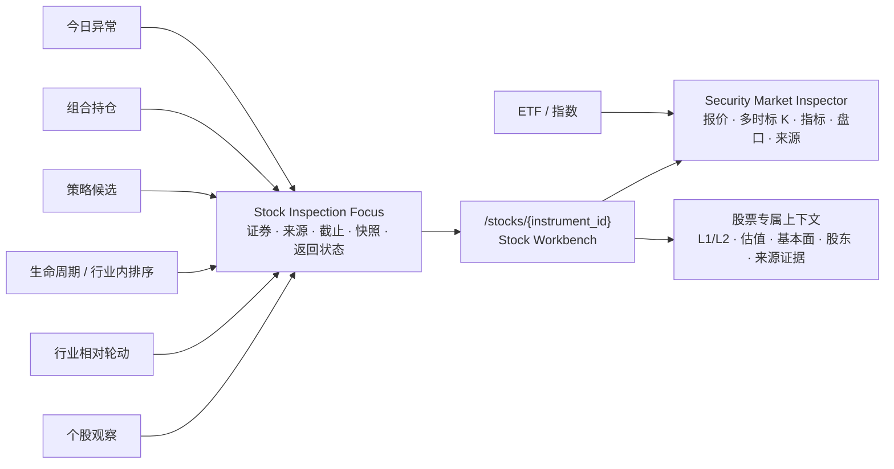

# WP-0048：通用个股工作面收敛

- 状态：`implemented`
- 需求：REQ-2026-0003 v1.6.0、REQ-2026-0004 v2.7.0、REQ-2026-0008
- 架构：ADR-0011
- 阶段：3、5、6 的共享展示底座
- UI：UI-PROP-0001 v0.7（`approved`）

## 目标

把个股观察、行业轮动、行业生命周期、行业内研究排序以及未来的策略候选、组合持仓和
异常入口统一到一个可路由、可恢复、点时正确的个股工作面。各入口只提供
`Stock Inspection Focus`，不再拥有自己的完整行情图、指标、盘口、估值或证据面板。

## 非目标

- 不把行业轮动、生命周期、策略比较或组合风险合并成一个业务上下文；
- 不建立第六个一级导航；
- 不让 ETF 进入股票专属的基本面和股东面板；
- 不把上下文专属研究分数写入行情事实；
- 不增加买卖、下单或策略晋级主动作；
- 不在本包重做 MiniQMT 留存；一分钟暖启动和多时标数据由 WP-0047 负责。

## 两层共享边界

### `Security Market Inspector`

股票、ETF、指数共用，且只能拥有：

- 证券身份与交易状态；
- 当前报价、当日行情尺、涨跌停和新鲜度；
- 完成日与盘中分层的多时标 OHLCV/成交额；
- MA、MACD 等版本化纯派生指标；
- 五档、价差和量差；
- 数据源、会话、参考日、缺口和内容身份。

### `Stock Workbench`

只用于 A 股个股，在行情内核之上增加：

- SW2021 L1/L2 点时行业身份和当前临时行业表现；
- 最近完成日估值、股本、市值及盘中派生值；
- 基本面、股东户数和事件证据的可用时间；
- 来源入口的比较集合和上下文证据；
- 返回原工作面的明确动作。

ETF 轮动继续使用 `Security Market Inspector`，不能通过类型判断在通用个股工作面中
隐藏大量不适用字段。

## 公共请求与投影

### `StockInspectionFocus`

- `focus_id`：规范内容哈希；
- `instrument_id`；
- `origin`：`watchlist / industry_rotation / industry_lifecycle /
  industry_ranking / strategy_candidate / portfolio_holding / attention_case`；
- `as_of` 与 `data_snapshot_id`；
- 可选 `industry_code / cohort_id / strategy_version_id /
  portfolio_snapshot_id / attention_case_id`；
- `mode`：`current / completed / historical_replay / sealed_evidence`；
- `return_target`：枚举化本地目的地和可恢复状态身份，不接受任意 URL；
- `created_at`。

### `StockWorkbenchProjection`

- `focus`；
- `instrument_identity`；
- `completed_market_evidence`；
- 可选 `realtime_market_overlay`；
- `industry_context`；
- `valuation_context`；
- `fundamental_context`；
- 可选的类型化 `origin_context`；
- 每个分区独立的 `state / as_of / provider / content_identity / known_gaps`。

组合根只能通过 Data、Market Regime、Strategy Research、Portfolio & Risk 的公共契约
组装只读投影，不能导入上下文内部模块。页面投影不是新的 `DataSnapshot`。

## 路由和交互

- 规范详情路由：`/stocks/{instrument_id}`；它是二级工作面，不是第六个一级入口；
- 顶部一级导航继续高亮 `StockInspectionFocus.origin` 所属入口；
- 面包屑显示例如“市场 / 行业相对轮动 / 半导体 / 有研新材”；
- “返回行业轮动”使用枚举化 `return_target` 恢复日期、行业、筛选、播放位置和视口；
- 刷新或复制链接后，准确快照、截止时间和来源上下文仍可重建；
- 从列表切换证券时保留来源和比较集合，生成新的 `focus_id`；
- `historical_replay` 和 `sealed_evidence` 默认不订阅当前 MiniQMT 行情；
- 紧凑列表和图节点可以显示名称、现价、涨跌和状态摘要，但完整分析必须进入规范路由。

## 入口迁移矩阵

| 入口 | 当前重复实现 | 收敛后行为 |
| --- | --- | --- |
| 个股观察 | `StockRealtimePage` + `RealtimeInstrumentPanel` | 列表选择后打开规范工作面，来源为 `watchlist` |
| 行业相对轮动个股层 | `StockHierarchyWorkbench` + `StockPriceWorkbench` | 轮动图只保留选择/比较，完整个股证据进入规范工作面 |
| 行业生命周期排序 | `IndustryRankingPanel` 内直接组合 `PriceChart` | 排序保留紧凑摘要，选择股票进入规范工作面 |
| ETF 轮动 | `RealtimeInstrumentPanel` + `EtfEvidenceChart` | 只复用 `Security Market Inspector`，保留 ETF 专属资格证据 |
| 大盘指数 | `OverviewView` 直接使用 `PriceChart` | 只复用 `Security Market Inspector` 的历史价格内核，不进入个股工作面 |
| 策略候选（未来） | 尚未收敛 | `strategy_candidate` 上下文增加信号标记和证据截止，不复制行情组件 |
| 组合持仓（未来） | 尚未收敛 | `portfolio_holding` 上下文增加持仓/风险摘要，不把订单动作放入行情内核 |
| 今日异常（未来） | 尚未收敛 | `attention_case` 上下文解释异常并返回原收件箱 |

## 实施顺序

1. 冻结 `StockInspectionFocus`、`StockWorkbenchProjection` 和来源枚举契约；
2. 从现有 `PriceChart`、`RealtimeMinuteChart`、`RealtimeOrderBook` 抽取
   `Security Market Inspector`，保留一套指标和新鲜度实现；
3. 完成 `/stocks/{instrument_id}`、分区渐进加载和实时 SSE；
4. 以个股观察作为首个入口迁移，验证 v0.6、刷新恢复和窄屏；
5. 迁移行业相对轮动和行业生命周期排序，删除它们的完整个股实现；
6. ETF 和指数只迁移共享行情内核；
7. 为未来 Strategy Arena、Portfolio 和 Today 提供类型化入口适配器；
8. 确认无调用后删除 `RealtimeMinuteChart`、`StockPriceWorkbench` 等兼容层。

## 验收

1. 相同 `instrument_id + data_snapshot_id + as_of + mode` 从不同入口打开时，行情事实、
   技术指标和内容哈希一致；
2. 不同入口只能改变 `origin_context`、面包屑和返回位置，不能改变基础行情语义；
3. 仓库只有一套完整 K 线/指标/盘口/新鲜度组件；代码扫描和组件测试阻止重新复制；
4. 行业轮动返回后恢复行业、日期、筛选、播放进度、缩放和所选证券；
5. 生命周期排序返回后恢复行业、排序、筛选和滚动位置；
6. 历史回放和封存证据不能出现截止时间后的 K 线或当前报价；
7. 完成日 `DataSnapshot` 和当前 MiniQMT 会话在视觉、契约和新鲜度上分层；
8. 任一上下文缺失时只降级对应分区，基础行情继续可读；
9. 桌面和窄屏覆盖 Loading、Empty、Stale、Disconnected、Blocked 和返回恢复；
10. 页面无账户、委托、撤单、组合修改或交易主动作。

## 受保护边界

本包不会因组件复用而允许 Market 导入 Strategy/Portfolio 内部实现，也不会把实时投影
写入历史快照。本包只实现只读行情与研究证据，不读取账户，不创建委托、撤单或交易回调。

## 实现结果

- 新增类型化焦点、投影契约、同快照适配器和规范个股 API；
- 建立唯一行情检查器与 `/stocks/{instrument_id}` 工作面；
- 个股观察、行业轮动、行业排序迁移为规范入口，ETF 复用行情内核；
- 删除重复完整行情与证据组件；历史与封存模式关闭实时覆盖；
- 前端组件、生产构建和后端接口集成测试通过。

### 2026-07-29 运行修复

首次使用真实当前快照时发现证券名称 SQL 使用 DuckDB 保留字别名，随后规范内容哈希
直接接收 `PriceCandle` 模型，二者使接口返回 500。现已改为明确字段别名、先规范化
蜡烛模型再计算哈希，并将 DuckDB 异常纳入 HTTP 失败边界。新增真实 Parquet 快照
集成测试和可见个股工作面 E2E，避免只依赖 mock 投影再次漏检。
