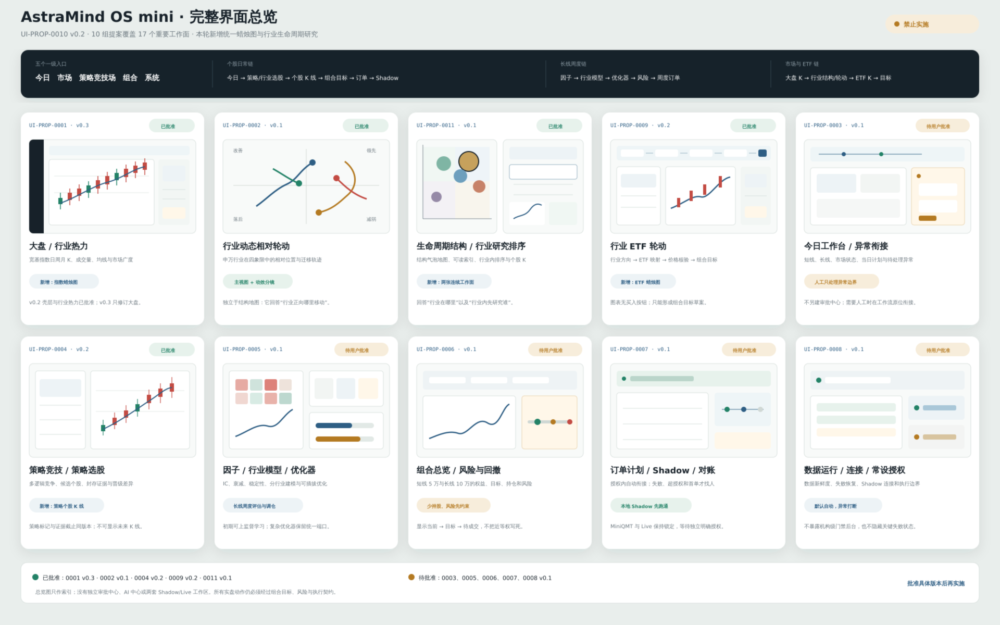

# 完整界面总清单

- 清单版本：0.3
- 状态：核心相关 UI-PROP-0005 v0.1 已过时，v0.2 待提交和视觉批准；执行相关
  提案也未表达 Research Shadow/Paper 新分层；通用个股工作面已规划，准确 v0.6
  视觉仍待批准
- 对应需求：[REQ-2026-0003](../requirements/REQ-2026-0003-complete-interface-schematics.md)
- 界面实现：部分实现；核心因子与 CorePolicy 工作面未开始

## 总览图

[打开总览 SVG](./proposals/0010-full-interface-atlas/interface-atlas-v0.2.svg)。

总览图用于快速检查信息架构；具体布局和批准以各 UI-PROP 高清图为准。

## 一级入口与工作面

| 工作面 | 建议位置 | 唯一任务 | UI 提案 | 状态 |
| --- | --- | --- | --- | --- |
| 今日工作台 | `/`、`/today` | 今天发生了什么、计划什么、为何行动或不行动 | UI-PROP-0003 | 待批准 |
| 需要你处理 | 全局抽屉 | 只处理超授权、失败和异常 | UI-PROP-0003/0007 | 待批准 |
| 大盘 | `/market?tab=overview` | 用所选宽基指数价格结构与市场广度判断环境 | UI-PROP-0001 v0.4 | 完成日与盘中临时层已实现 |
| 行业热力 | `/market?tab=industries&view=heatmap` | 比较行业参与与生命周期 | UI-PROP-0001 v0.4 | 完成日与盘中临时层已实现 |
| 相对轮动 | `/market?tab=industries&view=rotation` | 观察行业相对位置和迁移轨迹 | UI-PROP-0002 v0.1 已实现；v0.2 已批准 | 体验修订待实施 |
| 生命周期结构与行业研究 | `/market?tab=industries&view=lifecycle` | 解释行业结构位置，并在选定行业内确定研究优先级 | UI-PROP-0011 v0.1 | 已批准 |
| 通用个股工作面 | `/stocks/{instrument_id}`，由任一股票入口进入 | 在一个点时正确的工作面核验同一只股票的行情、行业、估值、证据与来源上下文 | UI-PROP-0001 v0.6、ADR-0011 | 已规划；视觉待批准，WP-0048 待实施 |
| ETF 轮动 | `/market?tab=etf` | 解释 ETF 候选、价格核验、拒绝和目标变化 | UI-PROP-0009 v0.2 | 已实现；截图受外部策略阻断 |
| 短线竞技场 | `/strategies?view=tactical` | 公平比较多类短线逻辑和 Research Shadow | UI-PROP-0004 v0.2 历史范围；新版本待提案 | 历史证据已批准，Research Shadow 待批准 |
| 策略证据 | `/strategies?view=evidence` | 检查候选个股、逐笔、失败场景、Research Shadow 和晋级差异 | UI-PROP-0004 v0.2 历史范围；新版本待提案 | 历史证据已批准，Research Shadow 待批准 |
| 因子研究 | `/strategies?view=core-factors` | 评价 F0/Alpha158/Alpha101 的覆盖、稳定性和选择 | UI-PROP-0005 v0.2 | 待提案 |
| 周期候选/CorePolicy | `/strategies?view=core-models` | 分别选择 H20/H60 候选并预览唯一核心策略 | UI-PROP-0005 v0.2 | 待提案 |
| 组合总览 | `/portfolio` | 理解当前资金、收益和目标差异 | UI-PROP-0006 | 待批准 |
| 风险与回撤 | `/portfolio?view=risk` | 解释集中、流动性、回撤和处理动作 | UI-PROP-0006 | 待批准 |
| 订单计划 | `/orders?view=plan` | 把目标转换为可理解的订单计划 | UI-PROP-0007 | 待批准 |
| 执行与对账 | `/orders?view=execution` | 解释提交、成交、拒绝和差异 | UI-PROP-0007 | 待批准 |
| 数据与作业 | `/system?tab=data` | 操作数据更新、覆盖和失败恢复 | UI-PROP-0008 | 待批准 |
| 方法与状态 | `/system?tab=methods` | 解释五类市场模型当前方法、生命周期门与回退原因 | UI-PROP-0013 v0.1 | 等待用户批准 |
| 执行设置 | `/system?tab=execution` | 查看 Research Shadow、MiniQMT Paper/Live、授权、Local Replay 与恢复 | UI-PROP-0008 新版本待提案 | 旧界面未表达新分层 |

除 `/stocks/{instrument_id}` 是 ADR-0011 冻结的唯一完整个股详情路由外，其余路由是
信息架构建议，不是已实现 API。紧凑摘要不要求独立 URL。

## 提案目录

| 提案 | 覆盖内容 | 图片 |
| --- | --- | --- |
| [UI-PROP-0001](./proposals/0001-shell-market-dashboard/proposal.md) | 应用框架、大盘、行业热力、个股实时观察与全景行情候选稿 | [v0.6 待批准](./proposals/0001-shell-market-dashboard/schematic-v0.6.svg) · [v0.5 已批准并实现](./proposals/0001-shell-market-dashboard/schematic-v0.5.svg) · [v0.4 历史批准](./proposals/0001-shell-market-dashboard/schematic-v0.4.svg) |
| [UI-PROP-0002](./proposals/0002-market-relative-rotation-map/proposal.md) | 行业资金相对轮动 | [v0.1](./proposals/0002-market-relative-rotation-map/schematic-v0.1.png) |
| [UI-PROP-0003](./proposals/0003-today-attention/proposal.md) | 今日、异常抽屉 | [v0.1](./proposals/0003-today-attention/schematic-v0.1.png) |
| [UI-PROP-0004](./proposals/0004-tactical-strategy-arena/proposal.md) | 短线竞技场、策略选股蜡烛图、证据与晋级 | [v0.2 已批准](./proposals/0004-tactical-strategy-arena/schematic-v0.2.png) · [v0.1](./proposals/0004-tactical-strategy-arena/schematic-v0.1.png) |
| [UI-PROP-0005](./proposals/0005-core-research-optimizer/proposal.md) | v0.1 因子/行业模型/优化器历史示意 | [v0.1 已过时](./proposals/0005-core-research-optimizer/schematic-v0.1.png)；v0.2 待提交 |
| [UI-PROP-0006](./proposals/0006-portfolio-risk/proposal.md) | 组合、目标、风险与回撤 | [v0.1](./proposals/0006-portfolio-risk/schematic-v0.1.png) |
| [UI-PROP-0007](./proposals/0007-order-execution/proposal.md) | 订单计划、异常、执行与对账 | [v0.1](./proposals/0007-order-execution/schematic-v0.1.png) |
| [UI-PROP-0008](./proposals/0008-system-operations/proposal.md) | 数据作业、连接、授权和恢复 | [v0.1](./proposals/0008-system-operations/schematic-v0.1.png) |
| [UI-PROP-0009](./proposals/0009-etf-rotation/proposal.md) | ETF 轮动、候选 ETF 蜡烛图与目标 | [v0.2 已批准](./proposals/0009-etf-rotation/schematic-v0.2.png) · [v0.1](./proposals/0009-etf-rotation/schematic-v0.1.png) |
| [UI-PROP-0010](./proposals/0010-full-interface-atlas/proposal.md) | 完整界面总览，仅作索引，不单独授权实现 | [v0.2](./proposals/0010-full-interface-atlas/interface-atlas-v0.2.png) |
| [UI-PROP-0011](./proposals/0011-industry-lifecycle-research/proposal.md) | 行业生命周期结构地图、行业内研究排序与联动个股蜡烛图 | [结构地图 v0.1 已批准](./proposals/0011-industry-lifecycle-research/structure-map-v0.1.png) · [研究排序 v0.1 已批准](./proposals/0011-industry-lifecycle-research/industry-ranking-v0.1.png) |
| [UI-PROP-0013](./proposals/0013-method-status/proposal.md) | 系统内五类市场模型的方法定义、生产状态、数据门和回退解释 | [v0.1 等待用户批准](./proposals/0013-method-status/schematic-v0.1.svg) |

## 三条核心用户路径

### 每日个股路径

`今日 → Research Shadow/策略证据 → 在位政策 → 目标组合 → 订单计划 → MiniQMT Paper/经授权 Live → 对账`

### 长线周度路径

`因子研究 → H20/H60 候选 → CorePolicy 预览/确认 → 核心目标 → 风险 → 周度订单计划`

### 市场与 ETF 路径

`大盘指数蜡烛 → 行业热力/生命周期结构/相对轮动 → 行业内研究或 ETF 候选 → 个股/ETF 价格核验 → 策略证据 → 目标组合`

市场观察不能绕过策略证据直接进入订单。

## 全局组件

- 五入口导航；
- 决策状态带；
- “需要你处理”异常入口；
- 页面级截止时间与新鲜度；
- 右侧检查器；
- 指数、个股和 ETF 共用的日/周/月蜡烛图检查器；
- 蜡烛图底部双端范围轴与悬浮逐 K 数据；
- 数据与方法详情；
- 状态：Loading、Empty、Stale、Blocked、Error、Disconnected；
- 刷新恢复；
- 窄屏底栏与底部检查器。

## 不单独建立页面

- 登录、组织、角色或审批中心；
- 发布、Formal/Preview 或能力资格后台；
- 数据集、快照、模型、作业、订单事件各自的 CRUD 管理页；
- 单独的行业生命周期一级入口；
- 单独的“AI 中心”；
- 重复的 Research Shadow、Local Replay、Paper 与 Live 工作台；Research Shadow
  属于策略证据，Local Replay 只在测试/诊断中出现。
