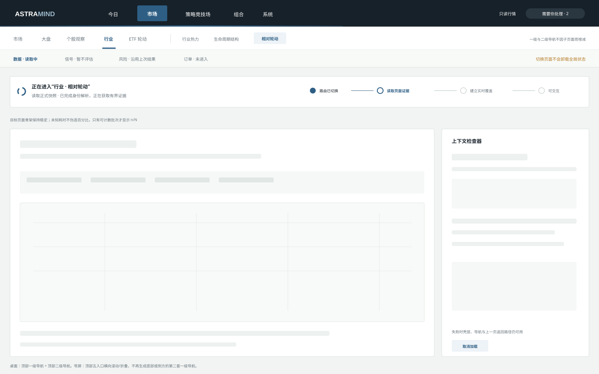
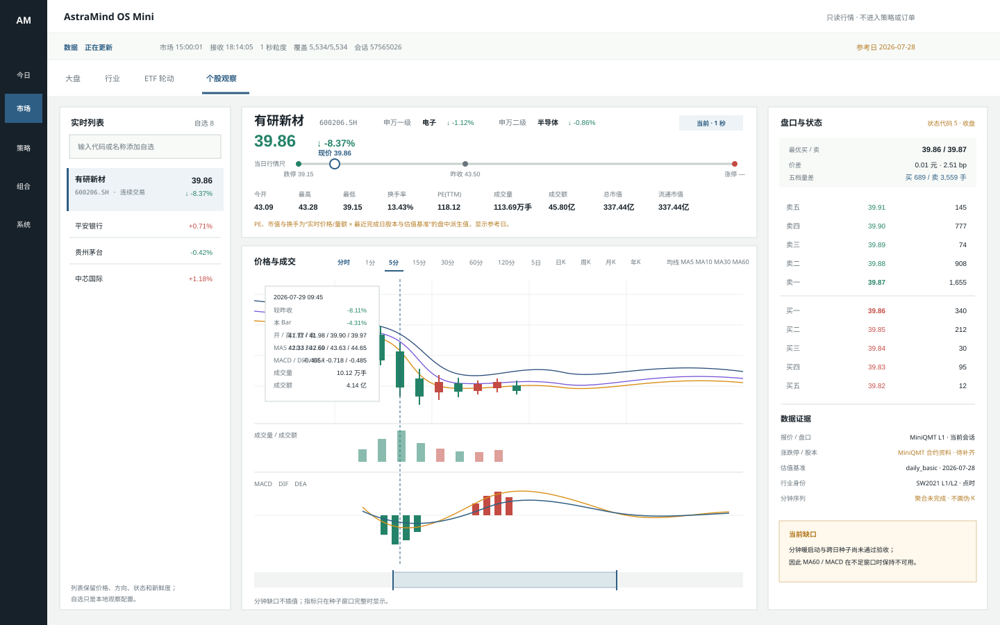
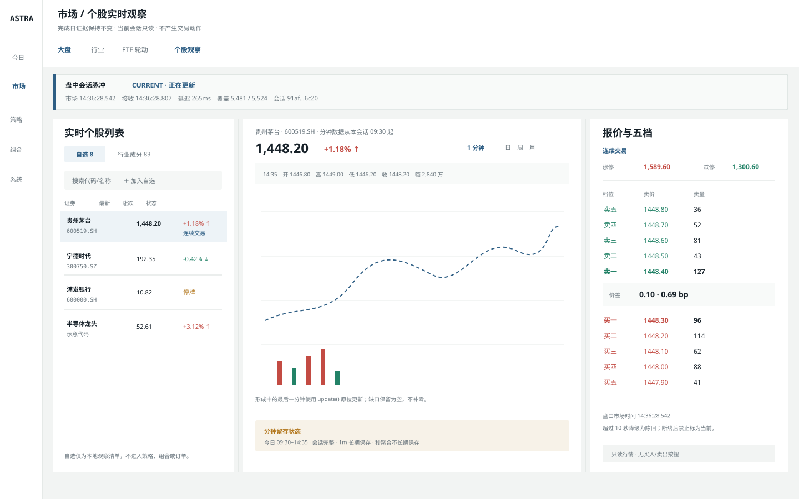
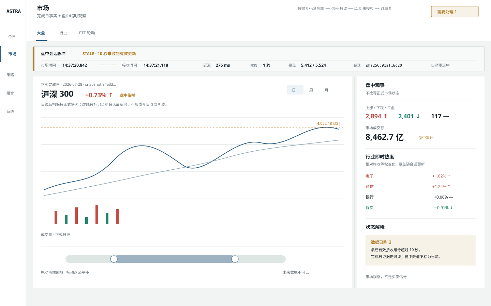

# UI-PROP-0001：应用框架、大盘与行业看板

- 版本：0.7
- 状态：`approved`
- 创建：2026-07-26
- 更新：2026-07-30
- 实现：v0.3 已由 WP-0038 实现；v0.4 已由 WP-0045 实施；v0.5 已由 WP-0046 实施；
  v0.6 未批准并由 v0.7 取代；v0.7 已由用户批准并由 WP-0048、WP-0049 实施
- 基于：0.6（未批准候选；v0.7 保留个股全景行情并修订全局壳层、导航和 Loading）
- 替代：0.1（界面文案中文化，并补充行业内部模式入口）

## 范围

本提案覆盖：

- 五入口应用框架；
- 决策状态带；
- “需要你处理”异常入口；
- 大盘视图；
- 行业热力视图；
- 行业内“行业热力 / 生命周期结构 / 相对轮动”模式入口；
- 个股观察与全景行情工作面；
- 预留 ETF 轮动页签。

它不批准或实现今日、策略竞技场、组合、系统内部页面，不批准交易动作或真实数据连接。相对轮动主画布由 [UI-PROP-0002](../0002-market-relative-rotation-map/proposal.md) 单独批准，生命周期结构与行业内研究排序由 [UI-PROP-0011](../0011-industry-lifecycle-research/proposal.md) 单独批准。

## 视觉示意图

### v0.7 统一顶部导航与分层 Loading 评审稿



[打开 v0.7 SVG 原图](./schematic-v0.7.svg)。

0.7 删除桌面侧方一级导航，只保留所有页面共同使用的一套顶部五入口导航：
“今日 / 市场 / 策略竞技场 / 组合 / 系统”。“订单”是组合与执行工作流内部页面，
不替代“策略竞技场”，也不成为第六个一级入口。

市场子导航始终使用“大盘 / 个股观察 / 行业 / ETF 轮动”；进入行业时，在同一顶部
区域显示“行业热力 / 生命周期结构 / 相对轮动”。进入 ETF、相对轮动或生命周期时，
一级和二级导航的条目、顺序、高度及当前态都不改变。自选列表、候选列表和右侧检查器
属于页面内容，不是第二套全局菜单。

应用壳层持续挂载并统一拥有导航、决策状态带、异常入口和路由加载状态。点击入口后：

1. 立即更新当前路由，并在顶部显示细进度线；
2. 保留完整导航与目标页面版式，显示稳定骨架；
3. 按真实阶段显示“读取页面证据 / 建立实时覆盖 / 可交互”；
4. 只有存在确定批次时显示 `n/N`，未知网络耗时不伪造百分比；
5. 加载失败时壳层、返回路径和重试仍可用；局部刷新不让整页退回 Loading。

动效只用于顶部进度线和低频加载标记，并遵守 `prefers-reduced-motion`。超过 300 ms
仍未完成时展示阶段说明；短于该阈值的切换只显示顶部进度线，避免闪烁。

### v0.6 个股全景行情台评审稿



[打开 v0.6 SVG 原图](./schematic-v0.6.svg)。

0.6 以用户提供的有研新材行情截图为字段参考，不复制第三方导航、外链或视觉外观。
页面保持 v0.5 的“列表—主画布—盘口”三栏，但把选中证券顶部扩展为一条连续的
“证券行情带”：名称、代码、现价、涨跌、L1/L2 行业、当日统计和参考日集中在同一
证据层。它不是一排孤立 KPI 卡。

本版本唯一新增的视觉记忆点是**当日行情尺**：把跌停、日内低点、现价、昨收、日内
高点和涨停放在同一价格刻度，帮助快速判断当前价格在当日可交易范围中的位置。缺失
涨跌停时保留空端点并标记“不可用”，不按板块比例猜测。

主画布统一复用价格检查器，支持分时、1/5/15/30/60/120 分钟、5 日和日/周/月/年
视角；成交量固定，MACD/DIF/DEA 为可切换副图。十字线固定展示所选 Bar 的
开高低收、较昨收涨跌、本 Bar 涨跌、成交量、成交额、均线和所选指标，避免“涨幅”
口径不明。分钟种子窗口不足时，MA/MACD 显示不可用，不以零或缩短窗口冒充。

右栏继续显示真实五档，并增加最优买卖、价差元/bp、五档量差和来源证据。来源证据
明确区分 MiniQMT 当前会话、MiniQMT 合约资料、最近完成日 `daily_basic` 与点时行业
成员；盘中派生估值必须显示参考日。

#### v0.6 作为通用个股工作面的视觉基线

ADR-0011 与 WP-0048 将 v0.6 定义为全产品唯一通用个股工作面的候选视觉基线，而不是
“市场 → 个股观察”私有页面。个股观察、行业相对轮动、生命周期排序、未来策略候选、
组合持仓和异常入口都通过 `Stock Inspection Focus` 进入同一 `/stocks/{instrument_id}`
二级工作面。

不同入口只能改变：

- 面包屑、来源说明和返回动作；
- 行业比较集合、策略版本、组合快照或异常身份等类型化上下文；
- 在证据截止允许范围内显示的策略标记或风险摘要。

不同入口不能改变行情带、行情尺、多时标价格检查器、指标、盘口、估值口径、来源证据
和状态语义。历史回放或封存证据模式默认关闭实时覆盖。列表、节点和表格可以保留紧凑
行情摘要，但完整个股分析不再嵌入各自页面。

ETF 和指数只复用 v0.6 中的 `Security Market Inspector` 行情内核，不进入包含股票
行业、估值、基本面和股东语义的完整个股工作面。

### v0.5 个股实时观察台评审稿



[打开 v0.5 SVG 原图](./schematic-v0.5.svg)。

0.5 在“市场”内部增加“个股观察”局部工作面，不增加一级导航。左侧统一列表提供
“自选 / 所选行业成分”两个来源；中间使用 Lightweight Charts v5 展示当前会话
一分钟 K 线和成交量；右侧显示交易状态、涨跌停价、真实五档和买卖价差。自选是
本地持久观察清单，不进入策略、组合或订单。

形成中的最后一分钟使用 `series.update()` 原位替换；首次进入用 `setData()` 装载
有界历史。分钟缺口保留为空，不插值、不补零。盘口与分钟图共享证券、会话、市场
时间和新鲜度；超过十秒整体降级。

### v0.4 盘中实时市场层评审稿



[打开 v0.4 SVG 原图](./schematic-v0.4.svg)。

0.4 保持 v0.3 的完成日蜡烛主画布和行业热力信息层级，只新增一条横贯工作面的
“盘中会话脉冲带”，并在既有检查器中加入盘中广度、成交额和行业即时热度。盘中值
使用虚线、状态文字和“盘中临时”标签，不能覆盖正式日线、市场状态、生命周期或
相对轮动结论。图中数字仅为布局示意。

### v0.3 大盘修订稿


[打开 v0.3 SVG 原图](./schematic-v0.3.svg)。

### v0.2 已批准的壳层与行业热力


[打开 v0.2 SVG 原图](./schematic-v0.2.svg)。

0.3 只修订大盘主分析画布；0.2 的五入口壳层和行业热力布局保持不变。所有数字与蜡烛均为布局示意，不代表真实行情。

[查看已被替代的 v0.1 渲染稿](./schematic-v0.1.png)；该版本不能用于实施。

## 页面任务

### 大盘

回答：“今天是什么样的 A 股市场？”

用户可以选择主要宽基指数，并用日/周/月蜡烛、成交量和均线核验价格结构；市场状态仍必须同时消费广度、成交、涨跌停和行业参与，不能由一张 K 线单独决定。

### 行业热力

回答：“当前哪些行业参与正在增强、减弱或发生变化？这个结论有多可信？”

## 本提案固定的选择

1. 只保留五个一级入口。
2. 大盘、行业、ETF 轮动位于同一个“市场”入口。
3. 桌面和窄屏只使用统一顶部一级导航，不生成侧方、底部或页面私有副本。
4. 顶部持续显示 `数据 → 信号 → 风险 → 订单`。
5. 使用一个主分析画布和一个右侧检查器，避免卡片套卡片。
6. “需要你处理”是唯一全局异常入口。
7. 科技、周期、传统经济只是同一行业分类的筛选视角，不建立独立页面。
8. 行业页使用“行业热力 / 生命周期结构 / 相对轮动”模式切换。
9. 行业检查器可以显示 ETF 映射证据，但不能下单。
10. 大盘主画布使用所选指数的蜡烛图和独立成交量窗格，右侧检查器解释市场广度与风险分歧。
11. 上证、深证、创业板、科创 50、沪深 300 和中证 1000 共享同一图表交互，不为每个指数建页面。
12. 图表底部使用双端时间范围轴；左右手柄调整窗口边界，拖动已选区间整体平移，价格与成交量同步缩放。
13. 鼠标悬浮使用十字线和逐 K 浮层显示交易日期、OHLC、涨跌额/幅、成交量、成交额和启用均线。

## 可见数据

### 共用框架

- 当前市场日期与交易状态；
- 数据新鲜度；
- 信号/策略就绪状态；
- 风险/授权状态；
- 计划订单数量；
- 需要人工处理的异常数量；
- 适用时的 Shadow/MiniQMT 状态。

### 大盘

- 主要 A 股指数；
- 所选指数的日/周/月 OHLCV；
- MA5/MA20 等少量可关闭均线；
- 时间窗口、十字线、实际截止时间和快照身份；
- 上涨/下跌广度；
- 新高/新低；
- 涨跌停与炸板结构；
- 全市场成交额与近期分位；
- 大小盘和风格表现；
- 市场状态和置信度；
- 数据缺口与风险观察；
- 紧凑行业强弱预览。

### 行业热力

- 可比较行业热力；
- 相对收益与强弱变化；
- 广度与成交额加速；
- 生命周期状态与持续时间；
- 置信度与覆盖率；
- 可用时的估值/财务上下文；
- 领先个股；
- ETF 方向/映射状态；
- 历史状态变化。

## 主要交互

- 切换大盘 / 行业 / ETF 轮动；
- 行业内切换行业热力 / 生命周期结构 / 相对轮动；
- 切换观察周期；
- 切换宽基指数和日/周/月 K；
- 拖动底部双端范围轴缩放或平移可视窗口；
- 鼠标悬浮蜡烛或成交量，通过同步十字线读取该根 K 线的完整数据；
- 选择行业更新检查器；
- 打开证据/方法详情；
- 打开“需要你处理”抽屉。

大盘与行业看板都没有交易主动作。

## 必备状态

- 保持布局的加载骨架；
- 首次使用/无快照；
- 新鲜完整；
- 新鲜但不完整；
- 陈旧；
- 行业归属覆盖不足；
- 指数 OHLCV 缺失、陈旧、复权口径错误或时间序列不单调；
- 生命周期不可用；
- 提供方不可用；
- 状态带中的 Shadow 或券商断开；
- 带重试/重建动作的严重错误。

未知或不完整使用灰色/赭色，不能显示绿色成功。

## 响应式行为

### 桌面

- 顶部一级导航与当前上下文二级导航固定、顺序一致。
- 主分析画布与检查器并排。
- 热力格尺寸可比较，图例固定。

### 窄屏

- 顶部导航保持唯一，可横向滚动或折叠未激活文字，但不能复制为底栏或侧栏。
- 决策状态带可以横向滚动。
- 选择行业后，检查器变为底部面板。
- 指数行与热力图允许横向滚动，不把文字压缩到不可读。
- 不静默删除数据列；低优先级字段进入详情。

## 不在本提案范围

- 最终像素抛光；
- 真实数据接口；
- 策略晋级；
- 订单或券商动作；
- 相对轮动的动态轨迹细节；
- 独立行业生命周期一级页面。

## v0.4 实时层固定选择

1. 页面先读取最后完成日正式投影，再建立一个 `EventSource` 消费当前会话；
2. 会话脉冲带同时显示市场时间、接收时间、接收延迟、1 秒粒度、证券覆盖和会话
   短身份；
3. `current` 使用聚焦蓝和“正在更新”，`stale` 使用赭石和“10 秒未更新”，
   `disconnected` 使用石墨灰和“连接已断开”；未知状态不使用绿色；
4. 大盘主画布只用虚线显示盘中最新价，不形成或追加今日正式蜡烛；
5. 盘中上涨/下跌/平盘、全市场累计成交额和行业即时热度进入既有检查器；
6. 行业热力保留完成日排序，盘中层只作为可辨识的临时覆盖，不改写正式值；
7. SSE 断开时完成日页面继续可用，盘中区域保留最后值但明确标为非当前；
8. 窄屏把会话脉冲带保持在页签下方并允许横向滚动，盘中检查器进入底部面板；
9. 页面卸载时关闭连接；浏览器原生重连期间显示“重新连接中”，不创建第二真相源；
10. 页面仍然只读，不增加刷新行情、交易或券商动作。

## v0.6 字段能力与展示决定

| 参考截图字段 | 当前管线事实 | v0.6 决定 |
| --- | --- | --- |
| 名称、代码、现价、涨跌幅 | MiniQMT L1 当前投影已直接提供 | 当前显示，并带市场/接收时间 |
| 今开、昨收、最高、最低 | MiniQMT L1 已直接提供 | 当前显示 |
| 成交量、成交额 | MiniQMT L1 已提供累计量额；股票成交量单位实测为手 | 当前显示并明确单位 |
| 五档买卖价格和数量 | MiniQMT L1 已直接提供 | 卖五→卖一、买一→买五，并派生价差和五档量差 |
| 交易状态 | MiniQMT `stockStatus` 已进入投影，但代码 5 等中文映射尚不完整 | 显示原始状态语义；未知代码不得标“正常” |
| 涨跌停价 | MiniQMT `get_instrument_detail` 已验证有 `UpStopPrice/DownStopPrice`；当前投影尚未批量接入，当日 `price_limit` 也可能未到 | 合约资料批量接入后显示；此前保持缺口 |
| 换手率 | 实时累计成交量与 `FloatVolume`/最近完成日流通股本均可获得 | 派生盘中换手率，显示股本参考日和单位 |
| PE(TTM) | 最近完成日 `daily_basic` 已有 PE(TTM)；截图数值等于完成日 PE 按实时价格缩放 | 显示“盘中估算 PE(TTM)”及参考日，不冒充提供方实时估值 |
| 总/流通市值 | MiniQMT 合约资料及 `daily_basic` 有总/流通股本 | 按实时价格派生并显示股本参考日 |
| 所属行业及涨跌 | 点时 SW2021 L1/L2 成员齐全；当前实时聚合只覆盖 L1 | 同时显示 L1/L2 名称与临时涨跌，二者不倒灌历史 |
| 分时和 1 分钟 K | 合约要求长期保存；本次审计发现当前聚合目录没有实际 Bar 文件 | 修复暖启动、聚合和恢复验收前不显示伪 K |
| 5/15/30/60/120 分钟 | 可从完整 1 分钟序列确定性聚合 | 聚合后显示，保持缺口 |
| 5 日分钟视图 | MiniQMT 历史 1 分钟接口可取；当前 API 只读当日 | 完成跨日分钟恢复后显示 |
| 日/周/月/年 K | `daily_market` 历史齐全，现有共享检查器已有日/周/月聚合 | 复用共享检查器；年 K 由完成日数据聚合 |
| MA5/10/30/60 | 可按所选周期收盘价派生 | 种子完整才显示 |
| MACD、DIF、DEA | 可按所选周期收盘价派生 | 固定参数版本，种子完整才显示 |
| Bar 成交量/成交额 | 规范分钟 Bar 已定义两者 | 十字线同时显示，不只画柱 |

截图中的“F10、股吧、雪球、问财”等属于第三方入口，不是行情数据，不纳入本地只读
工作面。作为超集，本页面新增参考截图没有的数据：流通市值、盘口价差、五档量差、
涨跌停位置、L1/L2 双层行业、市场时间/接收时间、会话身份、来源、参考日、缺口和
新鲜度。

## v0.6 固定选择（待批准）

1. 页面唯一任务调整为：“我关注的股票现在怎样交易，价格位于什么位置，量价与
   技术结构是否完整、当前值来自哪里？”
2. 左栏保留自选/行业成分和模糊搜索，不增加一级导航。
3. 主工作面保持三栏；证券行情带与行情尺位于主画布顶部，盘口及数据证据位于右栏。
4. 周期入口只改变同一价格检查器的数据频率，不创建多套图表或页面。
5. 分钟层与完成日日线层可以在同一检查器切换，但消息必须标明当前会话或完成日
   快照身份，不能把盘中 Bar 写入正式日线。
6. `PE(TTM)`、换手率、市值等盘中派生值均显示参考日；基准缺失时显示不可用。
7. 默认展示 MA5/MA10/MA30，MA60 可切换；成交量固定，副图默认 MACD。
8. 行情尺是唯一新增强调元素；不使用跳动数字、渐变、玻璃卡或装饰动画。
9. 窄屏顺序为“证券行情带 → 周期与图表 → 盘口 → 数据证据 → 个股列表”，行情
   统计横向滚动但不删除字段。
10. 页面保持只读，不增加买入、卖出、下单、策略晋级或组合动作。

### v0.6 必备状态

Loading、Empty 自选、证券无成交、集合竞价、连续交易、午休、停牌、收盘、涨跌停、
盘口单边缺失、估值基准缺失、行业成员缺失、分钟种子不足、分钟缺口、Stale、
Disconnected、合约资料缺失和数据损坏。指标窗口不足是明确的 `insufficient_seed`，
不是零值。

### v0.6 批准请求

`UI-PROP-0001 v0.6` 未获批准并已由 v0.7 取代。它的个股行情带、行情尺、多时标
检查器和数据证据完整并入 v0.7；旧侧方一级导航方向不得实施。

### v0.7 批准请求

`UI-PROP-0001 v0.7` 已获用户准确批准。WP-0049 据此收敛应用壳层、导航与 Loading，
WP-0048 据此迁移通用个股工作面。

## v0.5 已批准选择

1. 自选清单由本地后端持久化，默认空；输入证券代码片段或中文名称片段时，经短
   防抖实时显示按“代码前缀、名称前缀、代码包含、名称包含”排序的候选下拉列表，
   支持键盘选择后加入/移除；自选变化只是界面偏好，不改变任何研究快照。
2. “行业成分”来自当前所选行业和最近完成日成员身份，只用于实时观察；不把当前
   成员倒灌历史。
3. 列表显示最新价、涨跌幅、交易状态和新鲜度；选择证券后联动分钟图与五档。
4. 分钟图只读取已验证的一分钟聚合和形成中的当前 Bar，不读取秒级长期分区。
5. 五档同时显示价格与数量，卖盘从卖五到卖一、买盘从买一到买五；价差显示元和
   bp，盘口任一侧缺失时不计算伪造价差。
6. 涨跌停价来自当日合约观察；来源缺失时显示“不可用”，不按板块比例临时猜测。
7. `stale`、`disconnected` 时保留最后值但整体标记非当前，禁止局部字段继续显示为
   实时。
8. 窄屏顺序为“列表 → 报价/状态 → 分钟图 → 五档”，列表和盘口允许受控横向滚动。
9. 页面只读，无买入、卖出、下单、策略晋级或组合动作。

### v0.5 页面唯一任务

回答：“我关注的股票和所选行业成分现在怎样交易，盘口、状态与分钟价格是否新鲜？”

### v0.5 必备状态

Loading、Empty 自选、证券无成交、停牌、集合竞价、连续交易、涨跌停、盘口单边缺失、
分钟缺口、Stale、Disconnected、合约资料缺失和数据损坏。

### v0.5 批准请求

`UI-PROP-0001 v0.5` 已获批准，可由 WP-0046 实施。

## v0.4 必备状态

- Loading：完成日投影和首次实时 GET 分别加载，互不阻断；
- Empty：尚无实时投影时显示“等待 MiniQMT 会话”，完成日内容仍可读；
- Current：10 秒内收到有效行情，显示市场时间、接收时间和覆盖；
- Stale：超过 10 秒无有效更新，最后值降级且不标为当前；
- Disconnected：SSE 中断或服务无投影，显示连接已断开和自动重连；
- Blocked：投影身份或内容校验失败，只阻断盘中区域；
- Error：接口或消息解析失败，保留正式完成日页面并给出诊断入口。

## v0.4 批准内容

1. 接受“盘中会话脉冲带”作为实时层唯一新增布局；
2. 接受完成日蜡烛不追加形成中的今日 K，只以虚线显示当前指数价；
3. 接受盘中广度、成交额和行业即时热度复用右侧检查器；
4. 接受窄屏会话带横向滚动、检查器进入底部面板；
5. WP-0045 按准确版本 `UI-PROP-0001 v0.4` 实施 `EventSource` 和可见状态。

## 已确认

1. 五入口语义保持不变；v0.7 候选将其收敛为唯一顶部导航。
2. 大盘 / 行业 / ETF 轮动三个市场页签。
3. 顶部持续显示决策状态带。
4. 行业热力图加右侧检查器。
5. 行业内使用“行业热力 / 生命周期结构 / 相对轮动”模式切换。
6. 大盘以指数蜡烛为主画布，但市场判断仍由价格结构和广度共同形成。

## 批准记录

```text
approved_version: 0.7
approved_by: user
approved_at: 2026-07-29
source_message: "批准 UI-PROP-0001 v0.7 并实施 WP-0048 WP-0049"

candidate_version: 0.7
candidate_status: approved_and_implemented
candidate_source_message: "界面导航栏和切换也是有问题的：只保留上方导航；不同子菜单上方导航必须一致；进入页面等待时需要 Loading 进度。"

previous_approved_version: 0.4
previous_source_message: "批准 UI-PROP-0001 v0.4，并重新安装实时市场常驻任务"

historical_approved_version: 0.2
historical_source_message: "批准 UI-PROP-0001 v0.2 和 UI-PROP-0002 v0.1。"

superseded_candidate_version: 0.6
superseded_reason: "未获批准；其个股工作面内容并入 v0.7，旧侧方一级导航方向被替代。"
```

0.4 已批准为盘中实时层的准确视觉基线；0.3 继续记录完成日大盘实现。任何版本都不
授权交易行为、MiniQMT 账户或 Live；实现状态以本提案的工作包对照为准。

## WP-0048 / WP-0049 实现对照

2026-07-29，应用建立唯一持续挂载的 `AppShell` 和五入口注册表；市场与行业子导航由
壳层统一渲染，页面私有一级导航已删除。客户端路由切换立即显示顶部进度线，超过
300 ms 显示稳定骨架和真实阶段说明。

同次实施建立 `/stocks/{instrument_id}`、`StockInspectionFocus`、
`StockWorkbenchProjection` 与唯一 `SecurityMarketInspector`。个股观察、行业相对
轮动和行业内排序只保留紧凑选择入口；ETF 复用同一行情内核。四个旧的重复完整行情
与证据组件已删除；历史/封存模式不叠加当前 MiniQMT 会话，页面保持只读。

## WP-0045 实现对照

2026-07-29，WP-0045 按 v0.4 接入首次 GET 与单一 `EventSource`，页面显示盘中会话
状态、市场时间、接收时间、页面延迟、粒度、覆盖和会话身份；大盘以虚线当前价、
盘中广度和成交额形成临时覆盖，行业热力保留正式排序并增加盘中即时热度。组件卸载
会关闭 SSE，断线只降级盘中区域。

桌面、窄屏、断线与截图用例已写入 `tests/e2e/foundation.spec.ts`，但当前应用内本地
浏览器不可用，因此真实截图和交易时段连续 15 分钟 P95 验收尚未完成，不能标记通过。

## WP-0038 实现对照

2026-07-29，WP-0038 完成大盘与行业热力的真实数据投影、只读 API、桌面和窄屏实现。
实际截图保存在本地忽略目录：

- `var/evidence/wp-0038-market-overview.png`；
- `var/evidence/wp-0038-market-overview-mobile.png`；
- `var/evidence/wp-0038-industry-heatmap.png`；
- `var/evidence/wp-0038-industry-heatmap-mobile.png`。

实现保留桌面窄左栏、窄屏底栏、主画布加检查器、六宽基切换、日/周/月 K、双端范围
轴、31 行业热力、方向符号和只读声明。ETF、生命周期和交易动作未借此工作包开放。
