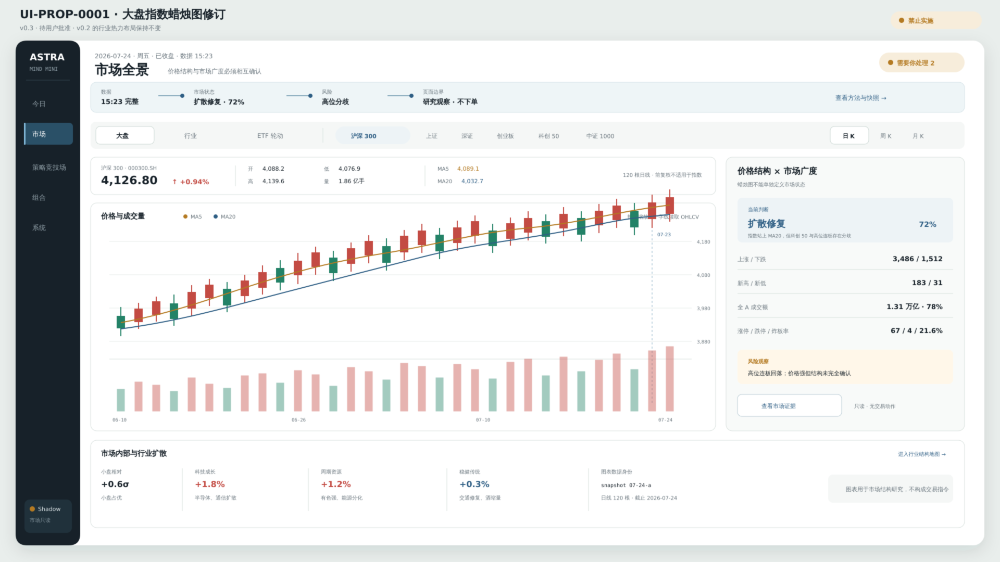
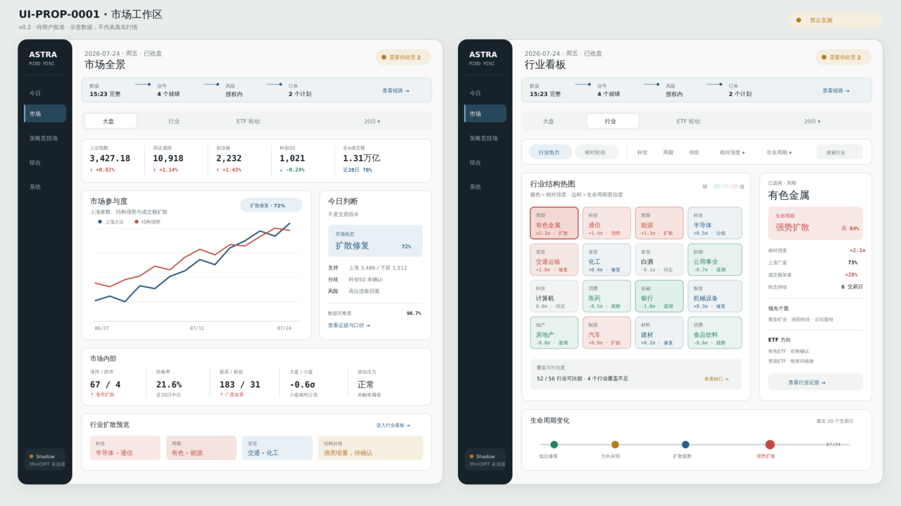

# UI-PROP-0001：应用框架、大盘与行业看板

- 版本：0.3
- 状态：`approved`
- 创建：2026-07-26
- 更新：2026-07-27
- 实现：视觉门禁已通过，尚未开始；本次批准不授权立即实施
- 基于：0.2（已批准；0.3 增加大盘指数蜡烛图）
- 替代：0.1（界面文案中文化，并补充行业内部模式入口）

## 范围

本提案覆盖：

- 五入口应用框架；
- 决策状态带；
- “需要你处理”异常入口；
- 大盘视图；
- 行业热力视图；
- 行业内“行业热力 / 生命周期结构 / 相对轮动”模式入口；
- 预留 ETF 轮动页签。

它不批准或实现今日、策略竞技场、组合、系统内部页面，不批准交易动作或真实数据连接。相对轮动主画布由 [UI-PROP-0002](../0002-market-relative-rotation-map/proposal.md) 单独批准，生命周期结构与行业内研究排序由 [UI-PROP-0011](../0011-industry-lifecycle-research/proposal.md) 单独批准。

## 视觉示意图

### v0.3 大盘修订稿



[打开 v0.3 SVG 原图](./schematic-v0.3.svg)。

### v0.2 已批准的壳层与行业热力



[打开 v0.2 SVG 原图](./schematic-v0.2.svg)。

0.3 只修订大盘主分析画布；0.2 的五入口壳层和行业热力布局保持不变。所有数字与蜡烛均为布局示意，不代表真实行情。

[查看已被替代的 v0.1 渲染稿](./schematic-v0.1.png)；该版本不能用于实施。

## 页面任务

### 大盘

回答：“今天是什么样的 A 股市场？”

用户可以选择主要宽基指数，并用日/周/月蜡烛、成交量和均线核验价格结构；市场状态仍必须同时消费广度、成交、涨跌停和行业参与，不能由一张 K 线单独决定。

### 行业热力

回答：“当前哪些行业参与正在增强、减弱或发生变化？这个结论有多可信？”

## 本提案固定的选择

1. 只保留五个一级入口。
2. 大盘、行业、ETF 轮动位于同一个“市场”入口。
3. 桌面使用窄左侧导航。
4. 顶部持续显示 `数据 → 信号 → 风险 → 订单`。
5. 使用一个主分析画布和一个右侧检查器，避免卡片套卡片。
6. “需要你处理”是唯一全局异常入口。
7. 科技、周期、传统经济只是同一行业分类的筛选视角，不建立独立页面。
8. 行业页使用“行业热力 / 生命周期结构 / 相对轮动”模式切换。
9. 行业检查器可以显示 ETF 映射证据，但不能下单。
10. 大盘主画布使用所选指数的蜡烛图和独立成交量窗格，右侧检查器解释市场广度与风险分歧。
11. 上证、深证、创业板、科创 50、沪深 300 和中证 1000 共享同一图表交互，不为每个指数建页面。
12. 图表底部使用双端时间范围轴；左右手柄调整窗口边界，拖动已选区间整体平移，价格与成交量同步缩放。
13. 鼠标悬浮使用十字线和逐 K 浮层显示交易日期、OHLC、涨跌额/幅、成交量、成交额和启用均线。

## 可见数据

### 共用框架

- 当前市场日期与交易状态；
- 数据新鲜度；
- 信号/策略就绪状态；
- 风险/授权状态；
- 计划订单数量；
- 需要人工处理的异常数量；
- 适用时的 Shadow/MiniQMT 状态。

### 大盘

- 主要 A 股指数；
- 所选指数的日/周/月 OHLCV；
- MA5/MA20 等少量可关闭均线；
- 时间窗口、十字线、实际截止时间和快照身份；
- 上涨/下跌广度；
- 新高/新低；
- 涨跌停与炸板结构；
- 全市场成交额与近期分位；
- 大小盘和风格表现；
- 市场状态和置信度；
- 数据缺口与风险观察；
- 紧凑行业强弱预览。

### 行业热力

- 可比较行业热力；
- 相对收益与强弱变化；
- 广度与成交额加速；
- 生命周期状态与持续时间；
- 置信度与覆盖率；
- 可用时的估值/财务上下文；
- 领先个股；
- ETF 方向/映射状态；
- 历史状态变化。

## 主要交互

- 切换大盘 / 行业 / ETF 轮动；
- 行业内切换行业热力 / 生命周期结构 / 相对轮动；
- 切换观察周期；
- 切换宽基指数和日/周/月 K；
- 拖动底部双端范围轴缩放或平移可视窗口；
- 鼠标悬浮蜡烛或成交量，通过同步十字线读取该根 K 线的完整数据；
- 选择行业更新检查器；
- 打开证据/方法详情；
- 打开“需要你处理”抽屉。

大盘与行业看板都没有交易主动作。

## 必备状态

- 保持布局的加载骨架；
- 首次使用/无快照；
- 新鲜完整；
- 新鲜但不完整；
- 陈旧；
- 行业归属覆盖不足；
- 指数 OHLCV 缺失、陈旧、复权口径错误或时间序列不单调；
- 生命周期不可用；
- 提供方不可用；
- 状态带中的 Shadow 或券商断开；
- 带重试/重建动作的严重错误。

未知或不完整使用灰色/赭色，不能显示绿色成功。

## 响应式行为

### 桌面

- 左侧导航固定且狭窄。
- 主分析画布与检查器并排。
- 热力格尺寸可比较，图例固定。

### 窄屏

- 导航变为底部栏。
- 决策状态带可以横向滚动。
- 选择行业后，检查器变为底部面板。
- 指数行与热力图允许横向滚动，不把文字压缩到不可读。
- 不静默删除数据列；低优先级字段进入详情。

## 不在本提案范围

- 最终像素抛光；
- 真实数据接口；
- 策略晋级；
- 订单或券商动作；
- 相对轮动的动态轨迹细节；
- 独立行业生命周期一级页面。

## 请确认

1. 五入口左侧导航。
2. 大盘 / 行业 / ETF 轮动三个市场页签。
3. 顶部持续显示决策状态带。
4. 行业热力图加右侧检查器。
5. 行业内使用“行业热力 / 生命周期结构 / 相对轮动”模式切换。
6. 大盘以指数蜡烛为主画布，但市场判断仍由价格结构和广度共同形成。

## 批准记录

```text
approved_version: 0.3
approved_by: user
approved_at: 2026-07-27
source_message: "蜡烛图底部轴要支持双头拖动缩放，鼠标悬浮显示具体数据，批准 UI-PROP-0001 v0.3、UI-PROP-0004 v0.2、UI-PROP-0009 v0.2、UI-PROP-0011 v0.1"
interaction_clarification: "底部双端范围轴；悬浮逐 K 数据"

previous_approved_version: 0.2
previous_source_message: "批准 UI-PROP-0001 v0.2 和 UI-PROP-0002 v0.1。"
```

0.3 已替代 0.2 成为大盘实现视觉基线；0.2 继续作为历史批准记录。该批准始终不授权交易行为、MiniQMT 或 Live，也不代表界面已经实现。
