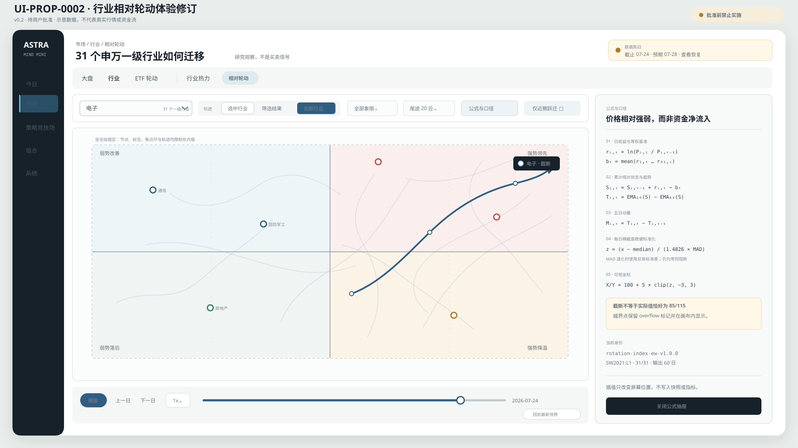
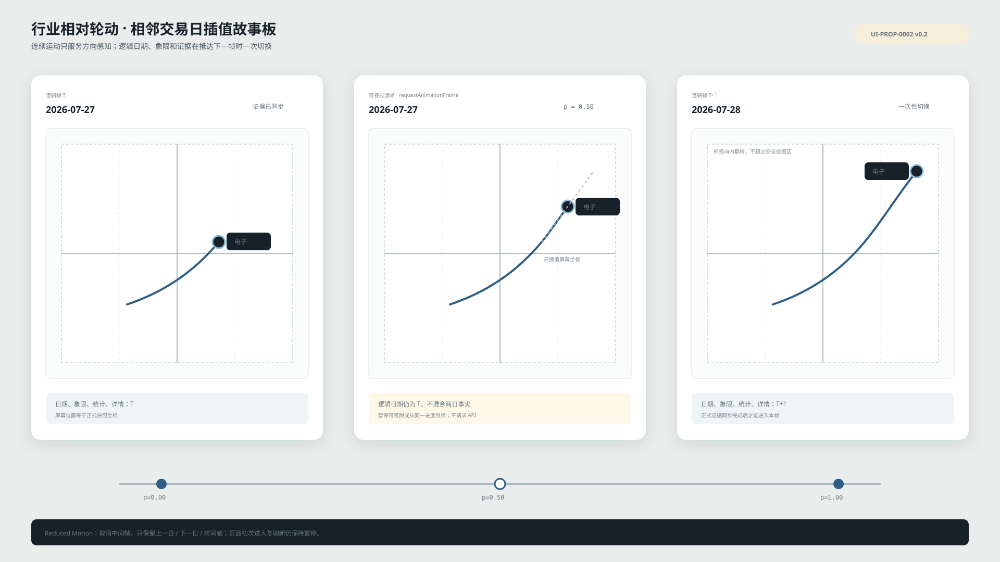

# UI-PROP-0002：行业资金相对轮动图

- 版本：0.2
- 状态：`approved`
- 创建：2026-07-27
- 修订：2026-07-28
- 实现：v0.1 已由 WP-0010 完成；v0.2 尚未实施
- 对应需求：[REQ-2026-0002](../../../requirements/REQ-2026-0002-market-relative-rotation-map.md)

## 参考来源

- 小红书视频笔记：[直观感受一下资金的轮动](https://www.xiaohongshu.com/explore/6a62fc420000000004029699)
- 作者：皮牛牛
- 用户描述：通过动态相对轮动图展示申万行业在不同市场阶段的迁移轨迹。

当前环境无法稳定回放原始小红书页面，因此本提案不声称逐帧复制视频。它复刻用户已明确要求的核心体验：行业节点在四象限中的连续迁移、历史尾迹和时间回放；具体视觉以本提案为准。

## 页面唯一任务

回答：

> 资金结构正在从哪些行业撤出、向哪些行业改善或加强？这个变化是短暂抖动，还是已经形成可确认的迁移？

页面是只读研究观察，没有下单或策略晋级动作。

## 视觉示意图

### 主界面



[打开 v0.2 主界面 SVG](./schematic-v0.2.svg)。

### 动态故事板



[打开 v0.2 动态故事板 SVG](./motion-storyboard-v0.2.svg)。

图中日期、坐标、行业状态和数量均为示意数据，不代表实际行情或研究结论。

v0.1 的
[主界面](./schematic-v0.1.svg)和[动态故事板](./motion-storyboard-v0.1.svg)
保留为已经实施的历史批准基线。

## 设计方向

### 结构

```text
┌ 导航 ┬ 状态带：数据 → 信号 → 风险 → 订单 ─────────────┐
│      │ 市场：大盘 / 行业 / ETF轮动                    │
│      │ 行业：行业热力 / 相对轮动                      │
│      ├──────────────────────────┬─────────────────────┤
│      │ 行业组合框 / 轨迹密度 / 象限 / 尾迹 / 公式入口 │
│      ├──────────────────────────┬─────────────────────┤
│      │ 安全绘图区                │ 选中行业检查器       │
│      │ 全部当前点 + 可选全部尾迹  │ 坐标/方向/跃迁/覆盖  │
│      │                          │ 公式与口径抽屉       │
│      ├──────────────────────────┴─────────────────────┤
│      │ 播放 / 速度 / 时间轴 / 尾迹长度 / 回到最新      │
└──────┴────────────────────────────────────────────────┘
```

### 记忆点

唯一醒目的元素是**迁移尾迹**：

- 当前节点最清楚；
- 越旧的点越淡；
- 路径末端有方向箭头；
- 播放时行业点在相邻交易日之间平滑移动，尾迹随逻辑日期推进；
- 用户可在“选中行业 / 筛选结果 / 全部行业”之间选择轨迹密度；
- 全部轨迹模式下，未选中轨迹保持低透明度，选中轨迹仍是唯一强视觉元素。

其余界面保持“安静的量化交易桌面”，不使用霓虹、发光或全屏娱乐化动画。

### 四象限

| 位置 | 名称 | 解释 |
| --- | --- | --- |
| 右上 | 强势领先 | 相对趋势强，动量仍在增强 |
| 右下 | 强势降温 | 相对趋势仍强，动量开始减弱 |
| 左下 | 弱势落后 | 相对趋势弱，动量仍弱 |
| 左上 | 弱势改善 | 相对趋势弱，但动量开始改善 |

横轴为相对趋势，纵轴为相对动量，中心值建议为 100。最终公式参数由实现阶段冻结，不由界面调整。

## 主要信息

### 状态区

- 数据截止时间；
- 数据完整/不完整；
- 行业注册表与覆盖数；
- 基准；
- 公式版本；
- “研究观察，不是买卖信号”。

### 主画布

- 四象限标题和解释；
- 当前注册表内所有合格行业节点；
- 选中、筛选命中或全部行业迁移尾迹；
- 当前日期；
- 相对趋势/相对动量坐标轴；
- 中性区域、公式截断与越界标记；
- 带内边距的安全绘图区，边界节点的标签和焦点环向内布局；
- 可访问图例。

### 右侧检查器

- 行业名称和所属分组；
- 当前象限、坐标与方向；
- 近 5/20 日相对变化；
- 覆盖率和成分数量；
- 最近结构跃迁；
- 基准、公式和数据限制；
- 可折叠技术身份。

### 公式与口径抽屉

- 行业对数收益与 31 行业等权基准；
- 累计相对状态与 20/60 日 EMA 趋势；
- 5 日趋势动量；
- 中位数/MAD 稳健 z-score 及退化规则；
- `100 + 5 × clip(z, -3, 3)` 坐标与截断说明；
- 中性带、连续确认期、覆盖、公式版本和快照身份；
- 明确说明这是价格相对强弱代理，不是直接资金净流入。

### 时间控制

- 播放/暂停；
- `0.5x / 1x / 2x`；
- 时间轴拖动；
- 上一日/下一日；
- 回到最新；
- 尾迹 10/20/40/60；
- 当前播放日期。

## 降噪规则

- 默认展示所有行业当前位置，但不默认展示所有行业完整尾迹。
- 默认只为选中行业显示清楚尾迹和名称。
- 用户可以切换筛选结果或全部行业轨迹；全部模式使用低透明度和有限标签。
- 其他节点保留可见轮廓，避免用户误以为行业从样本中消失。
- 行业选择使用可搜索组合框；未输入时下拉展示全部 31 个一级行业。
- 支持四象限筛选、仅选中和仅近期跃迁。
- 行业标签发生碰撞时优先保留选中行业、近期跃迁和极值行业。

## 动态规则

1. 首次进入和刷新后保持暂停。
2. 播放只遍历一次已加载的有界交易日数据。
3. 相邻交易日之间使用一个 `requestAnimationFrame` 循环插值所有节点的可视坐标。
4. 插值期间逻辑日期、象限、统计、检查器和跃迁列表仍属于起始日；抵达下一日后一次
   切换，避免混合两日证据。
5. 插值值只存在于浏览器显示层，不进入 URL、详情、API、快照或研究证据。
6. 播放过程中不发起逐帧业务请求。
7. 暂停、切页、筛选变化或组件卸载后清理唯一动画循环。
8. `prefers-reduced-motion` 下使用离散日期切换，不做平滑插值。
9. 拖动时间轴时暂停，释放后不自动继续，避免用户失去控制。

## 必备状态

- Loading：保留画布结构，明确正在加载哪个截止日；
- Empty：没有轮动快照，说明需要先补什么数据；
- Stale：比较预期完成交易日和快照截止日，显示落后日期、历史只读状态和恢复入口；
- Blocked：行业覆盖、方法或快照不满足要求；
- Provider Error：数据提供方失败，可重试；
- Data Corrupt：内容校验失败，不画部分节点；
- Success：覆盖、基准、公式、截止时间完整；
- Reduced Motion：关闭自动连续动画；
- Narrow Screen：主画布优先，检查器成为底部面板。

失败时禁止显示演示点、中心占位点或未说明的旧数据。

## 响应式行为

### 1920×1080 / 1440×900

- 左侧窄导航；
- 主画布占可用宽度约 72%；
- 右侧检查器约 28%；
- 时间控制固定在画布下方，不遮挡坐标轴。

### 窄屏

- 一级导航变为底栏；
- 顶部身份和筛选可横向滚动；
- 四象限画布保持最小可读宽度并允许受控横向查看；
- 检查器在选择行业后成为底部面板；
- 时间控制分为“播放行”和“时间轴行”；
- 不静默隐藏截止时间、失败状态或只读声明。

## 自我审查

被否决的初稿方向是“深色大屏 + 高饱和发光轨迹”。它虽然容易制造视觉冲击，却会把研究观察做成娱乐化行情大屏，也与已经确定的安静交易桌面冲突。

当前方案只把动效集中在迁移尾迹，其他区域保持平静；它属于这个项目，是因为尾迹直接表达行业资金结构的时间变化，而不是通用 Dashboard 装饰。

## 不在范围

- 真实相对轮动公式的最终参数；
- 行业数量写死为 56；
- 申万二级行业和“半导体”下钻；
- 逐像素复制小红书视频；
- 第三方 logo、视频、音频或专有公式；
- 分钟级或盘中实时动画；
- 个股列表全集；
- ETF 订单、个股推荐、买卖按钮；
- 用轮动象限直接生成交易计划。

## 已批准要点

用户批准的 v0.2 包含：

1. 相对轮动位于“市场 → 行业”内部，与“行业热力”切换。
2. 四象限名称采用“强势领先 / 强势降温 / 弱势落后 / 弱势改善”。
3. 行业控件改为可搜索组合框，并可以不输入文字浏览全部 31 个一级行业。
4. 轨迹模式提供“选中行业 / 筛选结果 / 全部行业”，默认选中行业。
5. 所有节点在相邻交易日之间插值移动，但逻辑事实只在抵达下一日后切换。
6. 主画布使用安全内边距，边界标签向内翻转，越界截断有明确标记。
7. “公式与口径”使用右侧抽屉完整展示，窄屏改为底部面板。
8. Stale 状态显示预期日期、实际截止日和恢复入口。
9. 保持浅色安静桌面，只把选中迁移尾迹作为唯一强动效。

## 批准记录

```text
approved_version: 0.2
approved_by: user
approved_at: 2026-07-28
source_message: "批准 UI-PROP-0002 v0.2。"
```

历史批准记录：

```text
approved_version: 0.1
approved_by: user
approved_at: 2026-07-27
source_message: "批准 UI-PROP-0001 v0.2 和 UI-PROP-0002 v0.1。"
```

v0.1 继续是当前已实施页面的准确历史基线；v0.2 是 WP-0024 可以使用的最新视觉
基线。此次视觉批准不等于开始实施，也不冻结新的轮动公式、不授权二级行业、策略或
交易。

## v0.1 实现核对

- 实施工作包：[WP-0010](../../../planning/work-packages/WP-0010-formal-industry-rotation.md)；
- 产品路径：`/market?tab=industries&view=rotation`；
- 桌面结果保持主画布约 72%、右侧检查器约 28%，尾迹是唯一强视觉元素；
- 窄屏保留数据截止日、公式、只读声明，并允许受控横向查看完整四象限；
- 页面实现 Loading、Empty、Data Corrupt、Provider Error 与 Success；不完整输入在发布侧
  失败关闭，不把部分节点交给页面；
- 浏览器烟测验证可见入口、行业选择、日期移动、URL 状态及回放期间无逐帧请求；
- 实际截图位于本地忽略目录 `var/evidence/wp-0010-market-rotation.png` 和
  `var/evidence/wp-0010-market-rotation-mobile.png`，不提交其中的运行时证据。

实现与批准示意图的信息结构一致。正式公式由 REQ-2026-0002 v1.1.0 冻结，仍不构成
策略或交易授权。

## v0.2 计划实施

- 计划工作包：[WP-0024](../../../planning/work-packages/WP-0024-market-rotation-experience-revision.md)；
- 日度新鲜度上游：[WP-0025](../../../planning/work-packages/WP-0025-daily-data-derived-snapshot-orchestration.md)；
- v0.2 只修订一级行业体验；申万二级“半导体”下钻由
  [WP-0026](../../../planning/work-packages/WP-0026-semiconductor-l2-drilldown.md)独立规划。
