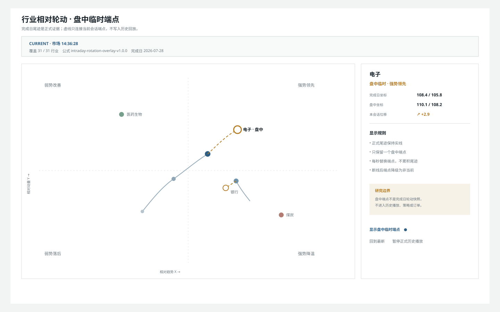
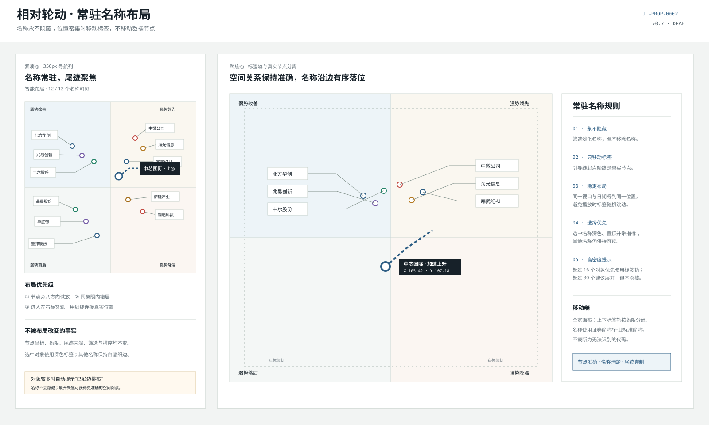
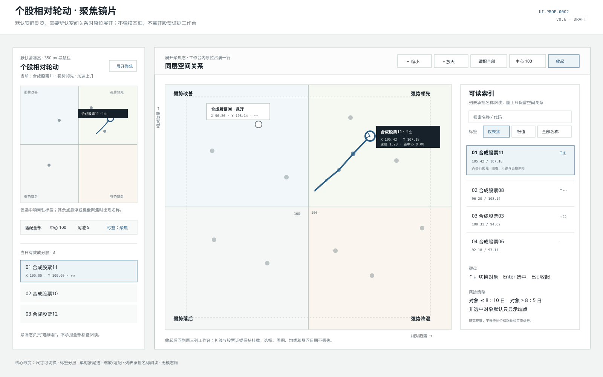
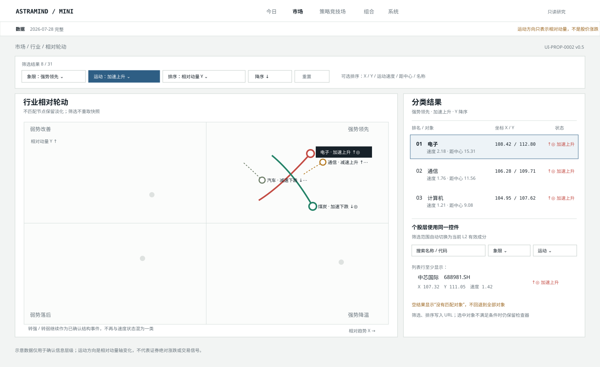
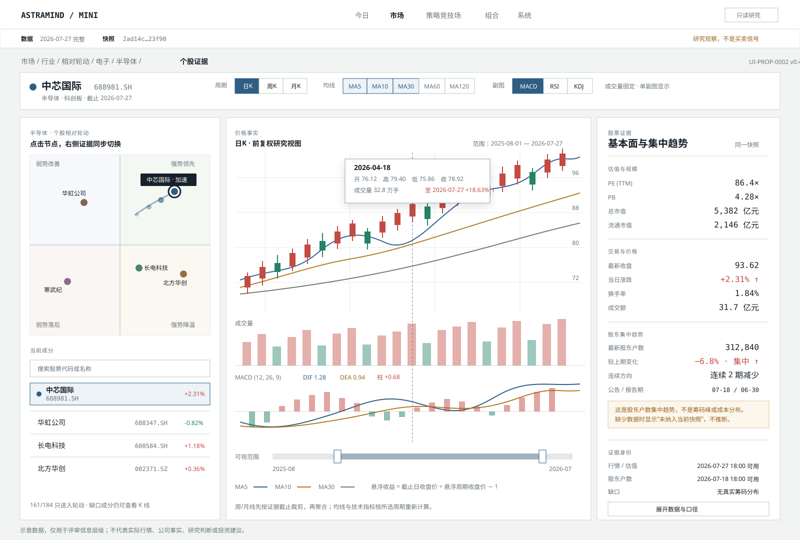
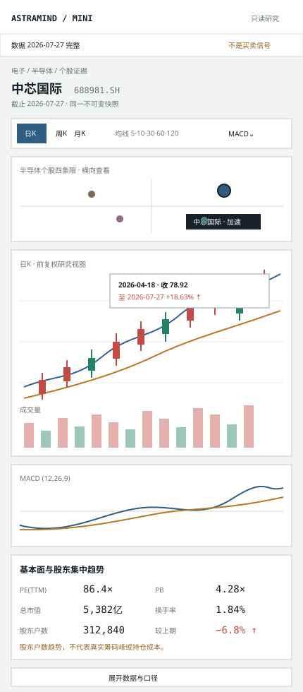
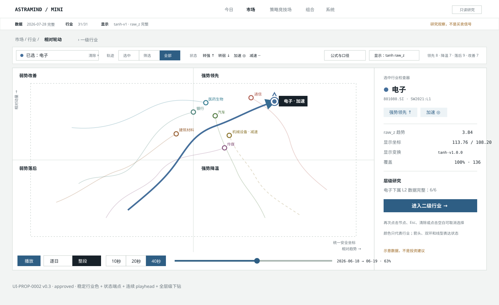
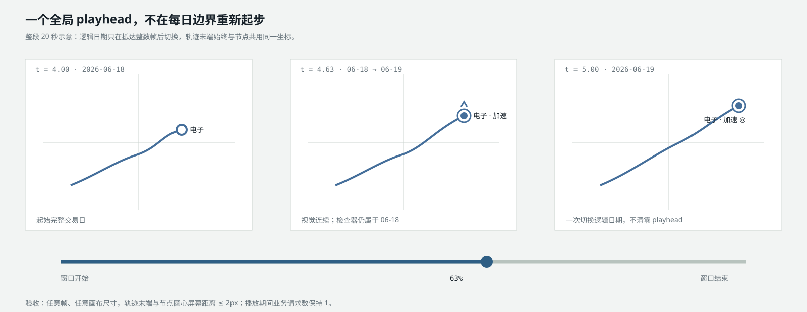
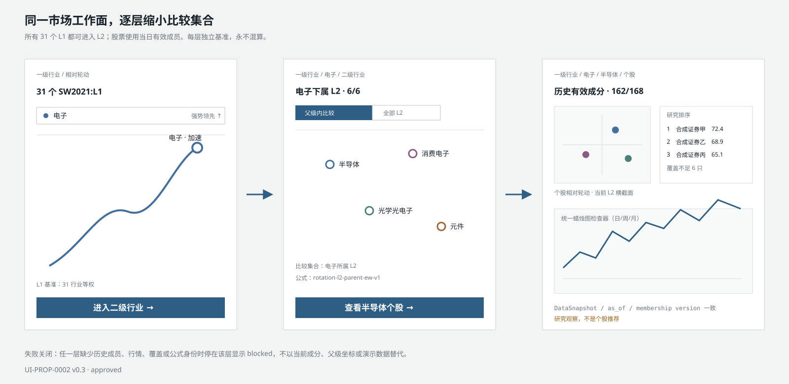

# UI-PROP-0002：行业资金相对轮动图

- 版本：0.8
- 状态：`approved`
- 创建：2026-07-27
- 修订：2026-07-30
- 实现：v0.1 已由 WP-0010 完成；v0.2 已由 WP-0024 完成；v0.3 已由
  WP-0027、WP-0028、WP-0026 完成；v0.4 已由 WP-0033 完成；v0.5 已批准并由
  WP-0034 完成；v0.6 已批准并由 WP-0036 完成；v0.7 已由 WP-0037 完成；
  v0.8 已批准，由 WP-0046 实施
- 对应需求：[REQ-2026-0002](../../../requirements/REQ-2026-0002-market-relative-rotation-map.md)

## 参考来源

- 小红书视频笔记：[直观感受一下资金的轮动](https://www.xiaohongshu.com/explore/6a62fc420000000004029699)
- 作者：皮牛牛
- 用户描述：通过动态相对轮动图展示申万行业在不同市场阶段的迁移轨迹。

当前环境无法稳定回放原始小红书页面，因此本提案不声称逐帧复制视频。它复刻用户已明确要求的核心体验：行业节点在四象限中的连续迁移、历史尾迹和时间回放；具体视觉以本提案为准。

## 页面唯一任务

回答：

> 资金结构正在从哪些行业撤出、向哪些行业改善或加强？这个变化是短暂抖动，还是已经形成可确认的迁移？

页面是只读研究观察，没有下单或策略晋级动作。

## 视觉示意图

### v0.8 盘中临时轮动端点评审稿



[打开 v0.8 SVG](./realtime-overlay-v0.8.svg)。

v0.8 保留 v0.7 的完成日节点、常驻名称与历史迁移尾迹，只从最后完成日节点用赭石
虚线连接一个“盘中临时端点”。每秒行情只替换该端点，不生成秒级尾迹，也不写入
历史播放。盘中端点使用独立方法身份 `intraday-rotation-overlay-v1.0.0`，基于当前
行业成分涨跌与完成日锚点形成同层横截面；不能冒充正式轮动快照。

切换到历史日期、启动正式历史播放或覆盖不足时隐藏盘中端点；回到最新后恢复。
`stale`/`disconnected` 保留端点位置但标记“非当前”。窄屏在画布上方保留临时状态，
检查器移到底部。

`UI-PROP-0002 v0.8` 已获批准。本版本不改变 v0.7 已批准的历史公式、标签和回放。

### v0.7 行业与个股常驻名称



[打开 v0.7 SVG](./persistent-label-layout-v0.7.svg)。

v0.7 修订 v0.6 的标签密度规则：所有有效行业和股票名称常驻显示，选中只改变强调
层级，不再决定名称是否出现。标签布局遵循“贴近节点 → 同象限错层 → 边缘标签轨”，
被移动的标签使用细引导线连接真实节点；节点坐标和选中尾迹不因排版改变。

### v0.6 个股轮动聚焦镜片



[打开 v0.6 SVG](./stock-rotation-focus-v0.6.svg)。

v0.6 不改变三列股票证据工作台的默认职责，而把左侧象限图拆成两个清晰层次：

- 默认紧凑态负责选股，只常驻选中对象标签；
- 原位聚焦态负责阅读空间关系，提供大画布、缩放、适配、中心复位与可读索引；
- 展开不是模态框，K 线和证据保持挂载，选择与悬浮上下文不丢失。

### 通用个股工作面收敛（WP-0048 规划）

v0.4～v0.7 已实现的个股 K 线和证据区在兼容期继续可用，但不再作为长期独立实现。
WP-0048 将轮动图保留为行业/个股空间关系、筛选和比较入口；选择个股进行完整分析时，
创建带行业、日期、筛选、播放位置和视口身份的 `Stock Inspection Focus`，进入
UI-PROP-0001 v0.6 所定义的通用个股工作面。

返回轮动图时必须恢复原行业、日期、筛选、播放、缩放、视口和所选证券。轮动页面可以
保留名称、节点、现价和涨跌等紧凑摘要，但不能继续拥有自己的完整价格图、指标、估值
和盘口语义。v0.8 的盘中轮动端点与正式轮动快照不因此改变。

## v0.7 常驻名称与碰撞规避

常驻名称不能简单等同于给全部节点打开现有标签：在 350px 紧凑图中，这会遮住象限、
节点和尾迹。v0.7 采用确定性的注记布局：

1. 每个名称先按右上、右、右下、左上、左、左下、上、下八个锚点试放；
2. 仍碰撞时在同一象限内错层，名称位置可以移动，数据节点不能移动；
3. 没有无碰撞位置时进入左右边缘标签轨，以细引导线回连真实节点；
4. 选中对象使用石墨黑标签并置顶，其他名称使用白底细边，但全部持续可见；
5. 筛选只降低不匹配对象的节点、名称和引导线透明度，不删除名称；
6. 同一日期、视口、对象集合和排序必须得到同一布局，播放时不能随机跳位；
7. 超过 16 个对象优先使用标签轨，超过 30 个提示展开聚焦，但仍不隐藏名称。

该取舍借鉴 Apache ECharts 对标签重叠、画布边缘布局和引导线的处理原则，但项目继续
使用自身轻量显示层，不引入第二套图表运行时。

## v0.7 响应式与状态

- 1440px 聚焦态使用左右标签轨；紧凑态使用较小字号和短引导线，所有简称仍出现；
- 390px 使用全宽画布，上下标签轨按象限分组，不产生页面级横向溢出；
- 行业使用注册表标准名称，股票使用证券简称，不截断成无法识别的字串或只留代码；
- Empty/Blocked 没有真实节点，因此不绘制名称或伪造标签；
- 标签布局、缩放和平移只读取当前已加载快照，不发起业务请求。

## v0.7 批准记录

```text
approved_version: 0.8
approved_by: user
approved_at: 2026-07-29
source_message: "批准 UI-PROP-0001 v0.5、UI-PROP-0002 v0.8、UI-PROP-0009 v0.3、UI-PROP-0011 v0.2，并继续实施"
```

此次批准只允许实现行业与个股轮动图的常驻名称显示层，不改变数据节点、轮动公式、
研究结论或任何交易授权。

### v0.5 运动分类、筛选与排序



[打开 v0.5 SVG](./motion-filter-sort-v0.5.svg)。

v0.5 保留 v0.4 的三列工作台和行业主画布，只增加紧凑筛选带与带指标列的排序结果。
图中行业、股票、坐标和状态都是示意数据。

### v0.4 个股证据工作台



[打开 v0.4 桌面 SVG](./stock-analysis-workbench-v0.4.svg)。



[打开 v0.4 窄屏 SVG](./stock-analysis-mobile-v0.4.svg)。

v0.4 图中公司、价格、估值、股东户数、指标和涨跌幅均为示意数据，只用于确认布局与
交互，不代表实际行情、公司事实、研究判断或投资建议。

## v0.6 问题诊断与成熟方案取舍

当前约 350px 左栏同时承载象限标题、轴、全部节点标签、尾迹、筛选和列表；当对象
集中在中心或数量增加时，缩小字体并不能解决遮挡，只会降低可读性。

参考 [StockCharts RRG View](https://help.stockcharts.com/charts-and-tools/sharpcharts/chartlists/rrg-view)
的交互组织：单对象高亮时淡化其他对象、尾迹长度可调、画布可缩放/适配/中心复位，
并用图下列表承担完整名称阅读。其 ChartSchool 也建议对象较多时缩短尾迹，避免图面
拥挤。AstraMind 只借鉴这些信息组织原则，不复制 RRG 专有指标、品牌或视觉。

最终取舍：

1. 不永久扩大左栏，避免长期压缩 K 线；
2. 默认只保留选中对象标签和尾迹，其他对象显示端点；
3. 悬浮或键盘聚焦临时显示名称、X/Y、速度与运动状态；
4. “展开聚焦”在工作台内原位占满一行，不使用模态框；
5. 聚焦态绘图区至少 680×520，并提供缩放、适配全部、中心 100；
6. 同屏可读索引承担完整名称、排名和键盘导航；
7. 对象超过 8 个时默认尾迹由 10 日缩短为 5 日，用户可显式修改。

## v0.6 响应式与状态

- 1440px：紧凑态维持三列；展开后象限与索引占满一行，K 线与证据移到下一行但不
  卸载；
- 390px：紧凑态使用全宽正方形；聚焦态使用全宽绘图区和下方索引，不产生横向页面
  溢出；
- Empty/Blocked 保留绘图区骨架并显示准确原因；没有坐标的列表对象不伪造中心点；
- 键盘 `↑/↓` 切换聚焦对象、`Enter` 选择、`Esc` 收起；触屏使用点选与明确按钮；
- 缩放、平移、标签、尾迹和展开状态只属于显示层，不改变 URL、快照或业务请求。

## v0.6 批准记录

```text
approved_version: 0.6
approved_by: user
approved_at: 2026-07-28
source_message: "批准 UI-PROP-0002 v0.6，并实施 WP-0036"
```

此次批准只允许实施 WP-0036 的个股轮动显示层可读性修订，不改变轮动公式、数据快照、
研究结论或任何交易授权。

## v0.5 市场方案调研与取舍

本次延续“筛选条件靠近结果、结果可排序、空结果不回退”的成熟 Screener 模式：

- [TradingView 筛选器](https://www.tradingview.com/support/solutions/43000718745-how-to-use-filters-in-screener/)：
  条件位于顶部并立即应用，可单项重置或整体重置；
- [TradingView Screener 表格](https://www.tradingview.com/support/solutions/43000718885-tradingview-screeners-walkthrough/)：
  筛选结果与可排序列配合，排序字段和方向保持可见；
- [Finviz Screener](https://finviz.com/help/screener)：
  以分类筛选收窄集合，再按技术或表现字段排序，强调快速导航和即时结果。

AstraMind 不引入大字段墙、保存模板或自动刷新，而采用：

1. 顶部紧凑显示象限、运动状态、排序字段、方向和重置；
2. 画布保留所有对象空间位置，不匹配对象淡化，列表只显示匹配结果；
3. 列表固定显示 X、Y、速度和状态，避免排序依据不可见；
4. 行业与个股复用同一控件和算法，不建立两套口径；
5. 筛选排序只消费已加载快照，不产生业务请求。

## v0.5 运动状态口径

“加速/减速”不再是缺少方向的标签。显示层用最近三个完整逻辑日的相对动量变化分类：

| 状态 | 含义 | 非颜色标识 |
| --- | --- | --- |
| 加速上升 | 相对动量向上，且本期绝对速度较上期增加 | `↑◎`、实线加粗 |
| 减速上升 | 相对动量仍向上，但速度没有继续增加 | `↑⋯`、短虚线 |
| 加速下跌 | 相对动量向下，且本期绝对速度较上期增加 | `↓◎`、实线加粗 |
| 减速下跌 | 相对动量仍向下，但速度没有继续增加 | `↓⋯`、短虚线 |
| 平稳 | 历史不足或变化落在版本化 epsilon 内 | `·`、细线 |

这里的“上升/下跌”只表示纵轴相对动量的变化方向，不是证券绝对价格涨跌、收益预测
或买卖信号。“转强/转弱”继续属于中性带连续确认事件，独立显示和筛选，不再抢占运动
速度状态。

## v0.5 筛选与排序

- 筛选：名称/代码、象限、五种运动状态、近期确认事件；
- 排序：名称、相对趋势 X、相对动量 Y、最新速度、距中心距离；
- 每个数值字段支持升序/降序；完全相同时以代码升序稳定消歧；
- 行业组合框展开后显示已排序结果；个股层在左侧四象限与成分列表之间显示同款紧凑
  控件；
- 画布对不匹配对象淡化而不是删除，避免空间分布突然改变；列表只显示匹配项；
- 当前选中对象被筛掉时检查器仍保留，并提示它不在当前结果中；
- 空结果显示准确原因和重置动作，不静默恢复全部对象；
- URL 保存 `motion`、`sort`、`order`，个股层使用 `stock_` 前缀；筛选不发起数据请求。

## v0.5 响应式行为

- 窄屏筛选带允许受控横向滚动，当前生效条件和重置始终可见；
- 排序结果行先显示名称、状态，再显示 X/Y/速度；不隐藏筛选结果数量；
- 个股层保持“四象限 → 筛选 → 列表 → K 线 → 证据”的批准顺序；
- 截止日期、只读声明和“不是股价涨跌”边界不隐藏。

### 主界面



[打开 v0.3 主界面 SVG](./schematic-v0.3.svg)。

### 动态故事板



[打开 v0.3 动态故事板 SVG](./motion-storyboard-v0.3.svg)。

### 层级下钻



[打开 v0.3 层级下钻 SVG](./hierarchy-drilldown-v0.3.svg)。

图中日期、坐标、行业状态和数量均为示意数据，不代表实际行情或研究结论。

v0.2 的[主界面](./schematic-v0.2.svg)和
[动态故事板](./motion-storyboard-v0.2.svg)保留为当前已实施的历史批准基线。

## v0.4 市场方案调研与取舍

本次调研只提取成熟产品的信息组织方式，不复制其品牌、配色、图标或专有交互：

- [TradingView 图表与指标布局](https://www.tradingview.com/support/solutions/43000692404-layouts-charts-drawings-indicators-and-their-interaction/)：
  价格主图保留叠加指标，成交量与振荡指标进入独立窗格；
- [TradingView 右侧标的详情](https://www.tradingview.com/support/solutions/43000745825-mastering-the-tradingview-watchlists/)：
  选择标的后在同一工作面显示基本面和技术摘要；
- [Koyfin Company Snapshots](https://www.koyfin.com/features/company-snapshots/)：
  右侧信息按公司概览、估值与历史事实分组，强调自上而下快速核验；
- [Finviz Screener](https://finviz.com/help/screener)：
  基本面与技术字段可以在同一研究工作流中快速切换，但本提案不采用其高密度字段墙；
- [Lightweight Charts 多窗格](https://tradingview.github.io/lightweight-charts/tutorials/how_to/panes)：
  当前项目使用的 v5.2.0 可以在同一时间轴上承载价格、成交量和一个技术指标窗格。

由此形成的 AstraMind 取舍是：

1. 左侧保留半导体等 L2 内个股四象限和可搜索列表，承担“选谁看”的导航任务；
2. 中央把 K 线作为主证据，成交量固定、MACD/RSI/KDJ 一次只显示一个，避免纵向拥挤；
3. 右侧只显示同一快照内可解释的估值、规模、交易事实与股东集中趋势；
4. 唯一强交互是“四象限点选 → 股票、K 线、指标、基本面同步切换”，不增加交易动作；
5. 股东户数变化准确命名为“股东集中趋势”，不冒充筹码峰或持仓成本分布。

## v0.4 桌面信息结构

```text
┌ L1 / L2 / 个股面包屑 ─ 股票身份 ─ 日K·周K·月K ─ 均线 ─ 副图 ┐
├────────────────┬────────────────────────┬──────────────────┤
│ 个股四象限       │ K 线 + MA5/10/30/60/120 │ 基本面与规模       │
│ 点击节点选股     │ 成交量（固定）            │ 交易与价格         │
│ 可搜索成分列表   │ MACD / RSI / KDJ（单选）  │ 股东集中趋势       │
│ 覆盖与缺口       │ 双端范围轴与悬浮收益       │ 证据时间与缺口     │
└────────────────┴────────────────────────┴──────────────────┘
```

桌面使用约 `26% / 48% / 26%` 三列。四象限继续承担空间比较，K 线是最大工作面，右侧
事实栏不使用卡片套卡片，只以分隔线区分信息组。

### 周期、均线与技术指标

- 周期提供日 K、周 K、月 K，切换后蜡烛、成交量、均线、技术指标和悬浮值同时重算；
- 均线提供 MA5、MA10、MA30、MA60、MA120，逐条开关；默认打开
  MA5、MA10、MA30；
- 成交量固定在价格下方；副图在 MACD、RSI(14)、KDJ(9,3,3) 中单选，默认 MACD；
- 图例始终显示启用指标、参数和当前悬浮周期的值；
- 每个周期至少需要 120 个已完成周期 Bar 才显示 MA120；不足时只隐藏该线并说明缺口，
  不用更短窗口替代。

### 悬浮收益

悬浮 K 线时显示 OHLC、成交量、成交额、启用均线和：

```text
从悬浮周期末到证据截止日的累计涨跌幅
= 证据截止日收盘价 ÷ 悬浮周期收盘价 − 1
```

界面同时显示起止日期。周/月线使用对应周期末收盘价；证据截止日是同一
`DataSnapshot/as_of` 中最后一个已完成交易日，不读取未收盘实时价。

### 基本面与股东集中趋势

右侧首期显示：

- `PE(TTM)`、`PB`、总市值、流通市值；
- 最新收盘、当日涨跌幅、换手率、成交额；
- 最新股东户数、较上期变化、连续增减方向、公告日、报告期和观察年龄；
- 行情、估值、股东户数各自的可用时间、来源和缺口。

“股东户数下降”可以显示“集中 ↑”，“股东户数上升”可以显示“分散 ↓”，但必须始终
附带“股东户数趋势，不代表真实筹码峰或持仓成本”的说明。当前不可变日度快照尚未
包含 `shareholder_count` 时显示“未纳入当前快照”，不能跨快照读取旧事件数据。

### 四象限选择联动

- 个股层四象限节点可点击、键盘选择并显示可访问名称；
- 选择后同步更新股票身份、K 线、成交量、技术指标、基本面、股东集中趋势和 URL；
- 列表选择和四象限选择是同一状态，不能出现两个不同的当前股票；
- 点击不合格轮动节点对应的列表股票仍可查看其已有 K 线与基本面，但四象限明确显示
  “面板不足，未进入轮动”，不伪造坐标；
- 切换股票时保留当前周期、均线和副图偏好，图表时间范围按新标的数据边界收敛。

## v0.4 响应式行为

- 窄屏按“股票身份与控制 → 可横向查看的四象限 → K 线 → 成交量 → 单个副图 →
  基本面与集中趋势”纵向排列；
- 均线控制折叠为一行摘要，点击后展开，不能把五条均线按钮挤出屏幕；
- 四象限选择后自动更新下方证据，不自动滚动到页面底部；
- 基本面和股东集中趋势使用两列键值布局，缺口说明保持完整；
- 截止日期、悬浮收益起止日期、只读声明和数据缺口不得在窄屏隐藏。

## 设计方向

### 结构

```text
┌ 导航 ┬ 状态带：数据 → 信号 → 风险 → 订单 ─────────────┐
│      │ 市场：大盘 / 行业 / ETF轮动                    │
│      │ 行业：行业热力 / 相对轮动                      │
│      ├──────────────────────────┬─────────────────────┤
│      │ 层级面包屑 / 行业组合框 / 轨迹 / 运动 / 公式入口 │
│      ├──────────────────────────┬─────────────────────┤
│      │ 安全绘图区                │ 选中行业检查器       │
│      │ 稳定行业色 + 状态端点       │ 坐标/状态/进入 L2    │
│      │                          │ 公式与口径抽屉       │
│      ├──────────────────────────┴─────────────────────┤
│      │ 逐日播放 / 10·20·40秒整段 / 时间轴 / 回到最新   │
└──────┴────────────────────────────────────────────────┘
```

### 记忆点

唯一醒目的元素是**迁移尾迹**：

- 当前节点最清楚；
- 越旧的点越淡；
- 路径末端有方向箭头；
- 播放时行业点在相邻交易日之间平滑移动，尾迹随逻辑日期推进；
- 用户可在“选中行业 / 筛选结果 / 全部行业”之间选择轨迹密度；
- 行业色跨组合框、节点、轨迹和检查器保持稳定；
- 转强、转弱、加速和减速由端点形状、箭头、线型及文字共同表达；
- 全部轨迹模式下，未选中轨迹保持低透明度，选中轨迹仍是唯一强视觉元素。

其余界面保持“安静的量化交易桌面”，不使用霓虹、发光或全屏娱乐化动画。

### 四象限

| 位置 | 名称 | 解释 |
| --- | --- | --- |
| 右上 | 强势领先 | 相对趋势强，动量仍在增强 |
| 右下 | 强势降温 | 相对趋势仍强，动量开始减弱 |
| 左下 | 弱势落后 | 相对趋势弱，动量仍弱 |
| 左上 | 弱势改善 | 相对趋势弱，但动量开始改善 |

横轴为相对趋势，纵轴为相对动量，中心值建议为 100。最终公式参数由实现阶段冻结，不由界面调整。

## 主要信息

### 状态区

- 数据截止时间；
- 数据完整/不完整；
- 行业注册表与覆盖数；
- 基准；
- 公式版本；
- “研究观察，不是买卖信号”。

### 主画布

- 四象限标题和解释；
- 当前注册表内所有合格行业节点；
- 选中、筛选命中或全部行业迁移尾迹；
- 当前日期；
- 相对趋势/相对动量坐标轴；
- 中性区域、原始 z、版本化 tanh 显示映射与极端值说明；
- 带内边距的安全绘图区，边界节点的标签和焦点环向内布局；
- 可访问图例。

### 右侧检查器

- 行业名称和所属分组；
- 当前象限、坐标与方向；
- 近 5/20 日相对变化；
- 覆盖率和成分数量；
- 最近结构跃迁；
- 基准、公式和数据限制；
- 可折叠技术身份。

### 公式与口径抽屉

- 行业对数收益与 31 行业等权基准；
- 累计相对状态与 20/60 日 EMA 趋势；
- 5 日趋势动量；
- 中位数/MAD 稳健 z-score 及退化规则；
- 既有 `100 + 5 × clip(z, -3, 3)` 逻辑坐标；
- `100 + 14 × tanh(raw_z / 2.5)` 显示映射和版本；
- 中性带、连续确认期、覆盖、公式版本和快照身份；
- 明确说明这是价格相对强弱代理，不是直接资金净流入。

### 时间控制

- 播放/暂停；
- `0.5x / 1x / 2x`；
- 时间轴拖动；
- 上一日/下一日；
- 回到最新；
- 尾迹 10/20/40/60；
- 当前播放日期。
- “逐日 / 整段”模式；
- 整段 10/20/40 秒。

## 降噪规则

- 默认展示所有行业当前位置，但不默认展示所有行业完整尾迹。
- 默认只为选中行业显示清楚尾迹和名称。
- 用户可以切换筛选结果或全部行业轨迹；全部模式使用低透明度和有限标签。
- 其他节点保留可见轮廓，避免用户误以为行业从样本中消失。
- 行业选择使用可搜索组合框；未输入时下拉展示全部 31 个一级行业。
- 支持四象限筛选、仅选中和仅近期跃迁。
- 行业标签发生碰撞时优先保留选中行业、近期跃迁和极值行业。

## 动态规则

1. 首次进入和刷新后保持暂停。
2. 播放只遍历一次已加载的有界交易日数据。
3. 逐日模式在相邻交易日之间插值；整段模式使用一个不在日期边界重启的全局
   playhead。
4. 插值期间逻辑日期、象限、统计、检查器和跃迁列表仍属于起始日；抵达下一日后一次
   切换，避免混合两日证据。
5. 插值值只存在于浏览器显示层，不进入 URL、详情、API、快照或研究证据。
6. 播放过程中不发起逐帧业务请求。
7. 暂停、切页、筛选变化或组件卸载后清理唯一动画循环。
8. `prefers-reduced-motion` 下使用离散日期切换，不做平滑插值。
9. 拖动时间轴时暂停，释放后不自动继续，避免用户失去控制。
10. 节点与轨迹末端使用同一个视觉帧和 `[0,100]²` 投影，任意尺寸下保持衔接。

## 必备状态

- Loading：保留画布结构，明确正在加载哪个截止日；
- Empty：没有轮动快照，说明需要先补什么数据；
- Stale：比较预期完成交易日和快照截止日，显示落后日期、历史只读状态和恢复入口；
- Blocked：行业覆盖、方法或快照不满足要求；
- Provider Error：数据提供方失败，可重试；
- Data Corrupt：内容校验失败，不画部分节点；
- Success：覆盖、基准、公式、截止时间完整；
- Reduced Motion：关闭自动连续动画；
- Narrow Screen：主画布优先，检查器成为底部面板。

失败时禁止显示演示点、中心占位点或未说明的旧数据。

## 响应式行为

### 1920×1080 / 1440×900

- 左侧窄导航；
- 主画布占可用宽度约 72%；
- 右侧检查器约 28%；
- 时间控制固定在画布下方，不遮挡坐标轴。

### 窄屏

- 一级导航变为底栏；
- 顶部身份和筛选可横向滚动；
- 四象限画布保持最小可读宽度并允许受控横向查看；
- 检查器在选择行业后成为底部面板；
- L1/L2/个股面包屑保持在画布上方，个股列表与蜡烛图按纵向顺序展开；
- 时间控制分为“播放行”和“时间轴行”；
- 不静默隐藏截止时间、失败状态或只读声明。

## 自我审查

被否决的初稿方向是“深色大屏 + 高饱和发光轨迹”。它虽然容易制造视觉冲击，却会把研究观察做成娱乐化行情大屏，也与已经确定的安静交易桌面冲突。

当前方案只把动效集中在迁移尾迹，其他区域保持平静；它属于这个项目，是因为尾迹直接表达行业资金结构的时间变化，而不是通用 Dashboard 装饰。

## 不在范围

- 真实相对轮动公式的最终参数；
- 行业数量写死为 56；
- L2/个股层的策略、推荐或交易动作；
- 逐像素复制小红书视频；
- 第三方 logo、视频、音频或专有公式；
- 分钟级或盘中实时动画；
- 个股列表全集；
- ETF 订单、个股推荐、买卖按钮；
- 用轮动象限直接生成交易计划。

## v0.3 已批准视觉要点

功能口径已经由用户确认，但以下准确视觉版本仍需单独批准：

1. 每个行业使用稳定色，颜色只表达行业身份；选中项增加石墨标签和粗线，其他轨迹
   降低透明度。
2. 转强使用向上箭头，转弱使用向下箭头，加速使用双环和最近轨迹加粗，减速使用
   短虚线；图例同时显示文字。
3. “逐日 / 整段”是同一控制区中的模式切换；整段模式显示 10/20/40 秒。
4. 再次点击、`Esc`、输入框清除和点击空白都取消选择；未选中时检查器显示全局概览。
5. 层级使用画布上方面包屑；选择 L1 后从检查器执行“进入二级行业”，避免节点单击
   同时承担选择和导航。
6. L2 默认显示“父级内比较”，可切换“全部 L2”；L2 进入股票后同屏提供轮动、
   可排序列表和统一蜡烛图。
7. tanh 只改变显示坐标；公式抽屉同时展示 raw_z、逻辑坐标、显示坐标和变换版本。
8. 轨迹末端与节点必须完全衔接，不因宽屏、窄屏、缩放或播放边界产生可见偏移。

## v0.2 已批准要点

用户批准的 v0.2 包含：

1. 相对轮动位于“市场 → 行业”内部，与“行业热力”切换。
2. 四象限名称采用“强势领先 / 强势降温 / 弱势落后 / 弱势改善”。
3. 行业控件改为可搜索组合框，并可以不输入文字浏览全部 31 个一级行业。
4. 轨迹模式提供“选中行业 / 筛选结果 / 全部行业”，默认选中行业。
5. 所有节点在相邻交易日之间插值移动，但逻辑事实只在抵达下一日后切换。
6. 主画布使用安全内边距，边界标签向内翻转，越界截断有明确标记。
7. “公式与口径”使用右侧抽屉完整展示，窄屏改为底部面板。
8. Stale 状态显示预期日期、实际截止日和恢复入口。
9. 保持浅色安静桌面，只把选中迁移尾迹作为唯一强动效。

## 批准记录

当前批准版本：

```text
approved_version: 0.7
approved_by: user
approved_at: 2026-07-28
source_message: "批准 UI-PROP-0002 v0.7，并实施 WP-0037"
```

此次批准只覆盖只读研究界面、同快照显示派生与客户端筛选排序，不授权策略、订单、
Paper、Live 或券商动作。

历史批准版本：

```text
approved_version: 0.4
approved_by: user
approved_at: 2026-07-28
source_message: "批准 UI-PROP-0002 v0.4，并实施"
```

当前已实施视觉基线：

```text
approved_version: 0.3
approved_by: user
approved_at: 2026-07-28
source_message: "批准 UI-PROP-0002 v0.3，完成WP-0027 → WP-0028 → WP-0026 数据子包与界面子包"
```

历史批准记录：

```text
approved_version: 0.2
approved_by: user
approved_at: 2026-07-28
source_message: "批准 UI-PROP-0002 v0.2。"
```

```text
approved_version: 0.1
approved_by: user
approved_at: 2026-07-27
source_message: "批准 UI-PROP-0001 v0.2 和 UI-PROP-0002 v0.1。"
```

v0.1、v0.2 继续作为历史批准基线；v0.3 是 WP-0027、WP-0028 与 WP-0026 的当前
准确视觉基线。此次批准允许实现只读 L1→L2→个股研究层，但不授权策略、账户或交易。

## v0.1 实现核对

- 实施工作包：[WP-0010](../../../planning/work-packages/WP-0010-formal-industry-rotation.md)；
- 产品路径：`/market?tab=industries&view=rotation`；
- 桌面结果保持主画布约 72%、右侧检查器约 28%，尾迹是唯一强视觉元素；
- 窄屏保留数据截止日、公式、只读声明，并允许受控横向查看完整四象限；
- 页面实现 Loading、Empty、Data Corrupt、Provider Error 与 Success；不完整输入在发布侧
  失败关闭，不把部分节点交给页面；
- 浏览器烟测验证可见入口、行业选择、日期移动、URL 状态及回放期间无逐帧请求；
- 实际截图位于本地忽略目录 `var/evidence/wp-0010-market-rotation.png` 和
  `var/evidence/wp-0010-market-rotation-mobile.png`，不提交其中的运行时证据。

实现与批准示意图的信息结构一致。正式公式由 REQ-2026-0002 v1.1.0 冻结，仍不构成
策略或交易授权。

## v0.2 实现核对

- 实施工作包：[WP-0024](../../../planning/work-packages/WP-0024-market-rotation-experience-revision.md)；
- 已实现统一插值进度、安全绘图区、三种轨迹密度、31 行业组合框、公式抽屉和显式
  新鲜度状态；页面没有改变正式公式或公共快照身份；
- 桌面公式保持右侧检查面板，窄屏落在画布下方；实际截图位于本地忽略目录
  `var/evidence/wp-0024-market-rotation.png` 和
  `var/evidence/wp-0024-market-rotation-mobile.png`；
- 浏览器测试证明动画存在中间帧而逻辑日期不提前，全轨迹数量与行业数一致，交互期间
  业务快照只请求一次；
- 日度新鲜度上游：[WP-0025](../../../planning/work-packages/WP-0025-daily-data-derived-snapshot-orchestration.md)；
- v0.3 新范围分别由
  [WP-0026](../../../planning/work-packages/WP-0026-semiconductor-l2-drilldown.md)、
  [WP-0027](../../../planning/work-packages/WP-0027-rotation-display-transform-coordinate-projection.md)
  和
  [WP-0028](../../../planning/work-packages/WP-0028-rotation-identity-motion-continuous-playback.md)
  承接；v0.3 已于 2026-07-28 批准并已获得按顺序实施指令。

## v0.3 实现核对

- raw_z/tanh 显示、统一投影、稳定行业色、运动状态、整段播放和取消选择已实现；
- L1→L2→个股工作流已实现，并严格消费同一 DataSnapshot 与 as_of；
- 当前生产快照尚未发布 L2，真实页面显示明确阻断和恢复说明，不显示示例半导体数据；
- 本地浏览器证据写入 Git 忽略目录
  `var/evidence/wp-0028-market-rotation.png`、
  `var/evidence/wp-0028-market-rotation-mobile.png` 和
  `var/evidence/wp-0026-industry-hierarchy-blocked.png`。

## v0.4 实现核对

- [WP-0033](../../../planning/work-packages/WP-0033-stock-evidence-workbench.md) 已实现
  四象限/列表统一选股、日/周/月 K、MA5/10/30/60/120、MACD/RSI/KDJ、成交量、
  双端范围轴和悬浮至日线证据截止日收益；
- 股票基本面、行情与股东集中趋势只读取同一个 `DataSnapshot/as_of`；缺少
  `shareholder_count` 时显示数据集缺口，不跨快照读取；
- 1440×900 实际页面保持左侧导航、中间价格证据、右侧事实栏；390×844 按四象限、
  成分列表、价格图、证据栏顺序纵向展开且没有页面级横向溢出；
- Playwright 使用隔离合成快照验证四象限点选、URL、月 K、RSI、MA120、悬浮收益、
  股东趋势与桌面/窄屏截图；实际证据位于 Git 忽略目录
  `var/evidence/wp-0033-stock-evidence-workbench.png` 和
  `var/evidence/wp-0033-stock-evidence-workbench-mobile.png`。
- 个股切换保留四象限、列表与当前图表 DOM，只覆盖价格和证据工作面；成功响应缓存到
  当前不可变快照会话，来回切换不重复请求，失败时保留上一份完整证据。
- v1.5.1 行为修订复用 v0.4 布局：十字光标日期在内存中同步驱动右侧基本面与股东
  集中趋势，严格选择悬浮日已可用证据；浏览器证据为
  `var/evidence/wp-0033-hover-synchronized-evidence.png`。

## v0.6 实现核对

- [WP-0036](../../../planning/work-packages/WP-0036-stock-rotation-focus-lens.md) 已实现
  紧凑端点视图、选中尾迹、原位聚焦、缩放/平移/适配、标签与尾迹控制和可读索引；
- 展开和收起只改变显示层布局，K 线及股票证据保持挂载，浏览器断言显示控制没有发起
  新的层级业务请求；
- 1440px 有效绘图区达到至少 680×520；390px 工具栏换行、画布与索引全宽排列且没有
  页面级横向溢出；
- 实际截图位于 Git 忽略目录
  `var/evidence/wp-0036-stock-rotation-focus.png` 和
  `var/evidence/wp-0036-stock-rotation-focus-mobile.png`。

## v0.7 实现核对

- [WP-0037](../../../planning/work-packages/WP-0037-persistent-rotation-label-layout.md)
  已在行业和个股共用图层实现全部名称常驻；
- 布局按固定代码顺序执行八方向试放、边缘标签轨和网格兜底，只改变标签矩形，不修改
  节点坐标、尾迹或业务快照；
- 60 个对象的 350×380 密集算法测试证明结果确定、全部标签在界内且互不重叠；
- 浏览器流程同时断言行业与个股标签数等于节点数、实际 DOM 标签无重叠、显示控制
  不发起层级业务请求；
- 桌面与 390px 实际截图位于 Git 忽略目录
  `var/evidence/wp-0037-industry-persistent-labels.png`、
  `var/evidence/wp-0037-stock-persistent-labels.png` 和
  `var/evidence/wp-0037-stock-persistent-labels-mobile.png`；密集模式选中标签使用独立
  最小高度避免中文裁切，证据为 `var/evidence/wp-0037-selected-label-readable.png`。
