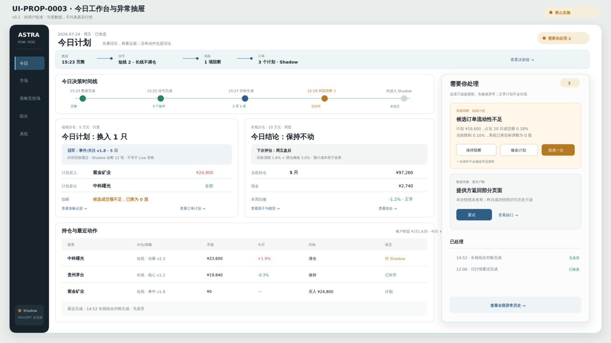

# UI-PROP-0003：今日工作台与异常抽屉

- 版本：0.1
- 状态：`superseded`
- 创建：2026-07-27
- 实现：WP-0020 已完成；WP-0032 已接入共享日常运行异常投影；真实 Paper 事件状态待
  首个周期补充
- 替代原因：2026-07-29 最终产品方向要求区分多候选 Research Shadow、单账户
  Paper 虚拟分仓和 Local Replay；当前版未表达该证据与账户分层

## 唯一任务

让用户在一分钟内回答：今天发生了什么、系统计划什么、为什么行动或不行动、是否真的需要我处理。

## 示意图



[打开 SVG](./schematic-v0.1.svg)。

图中日期、证券、金额、收益和状态均为布局示意，不代表真实行情、研究结论或实盘资格。

## 核心选择

- 不做 KPI 拼盘，按“市场已收盘 → 数据完成 → 策略产生目标 → 风险检查 → 订单计划”形成今日决策时间线。
- 短线 5 万元和长线 10 万元并排，但各自保留不同节奏。
- 正常计划只显示状态和下一步，不要求逐项批准。
- “需要你处理”抽屉只容纳超授权、风险阻断、数据失败和对账差异。

## 可见数据

- 市场状态、数据截止时间和新鲜度；
- 短线/长线资金、持仓、今日目标和不行动原因；
- 当前持仓重要盈亏；
- 今日候选、退出和现金目标；
- 风险与常设授权结果；
- 计划订单与 Shadow/券商状态；
- 最近完成的执行和对账。

## 主要交互

- 打开策略证据；
- 打开目标组合；
- 打开订单计划；
- 查看不行动原因；
- 打开“需要你处理”；
- 对异常执行重试、保持阻断或批准一次例外。

## 必备状态

首次使用、交易日未开始、数据更新中、无目标、正常不行动、陈旧、风险阻断、Shadow 断开、Broker 断开、对账中、严重错误。

## 响应式

窄屏按时间线顺序纵向排列；短线优先，长线折叠；异常抽屉变为全高底部面板。

## 不在范围

研究参数、完整逐笔回测、券商设置、数据集管理、常规逐单审批。

## 请确认

1. 今日页以决策时间线而不是 KPI 卡片为主。
2. 短线与长线并列，短线优先。
3. 正常计划不重复审批，异常集中到右侧抽屉。

## 批准记录

```text
approved_version: 0.1
approved_by: user
approved_at: 2026-07-28
source_message: “继续完成：→ WP-0019 持续 Paper → 批准相关 UI 提案 → WP-0020 操作界面与正式验收”
```

## WP-0032 实现对照

日常运行异常在既有时间线之前置顶，只显示部署确认、超时、关键缺口或恢复请求，不把正常
等待提供方当作失败。系统页和“今日”页读取同一个持久投影；运行、恢复和重试按钮只登记
本地控制请求，不产生订单或提供方调用。
