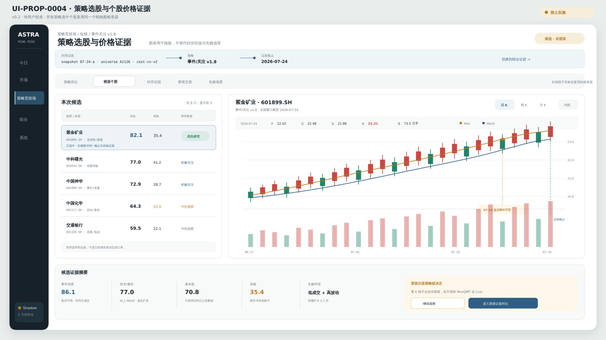
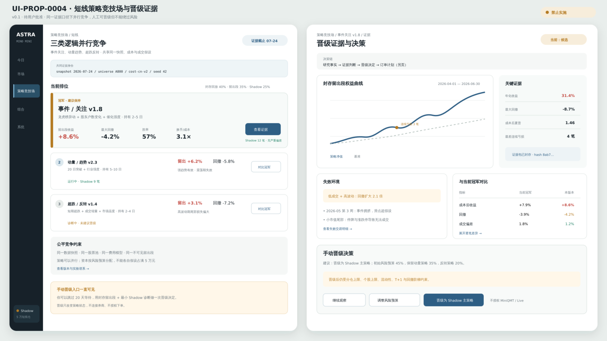

# UI-PROP-0004：短线策略竞技场与证据详情

- 版本：0.2
- 状态：`approved`
- 创建：2026-07-27
- 实现：视觉门禁已通过，尚未开始；本次批准不授权立即实施

## 唯一任务

用同一把尺比较事件/关注、动量/突破、反转/量价等策略家族，并决定哪个明确版本可以产生短线目标。

## 示意图

### v0.2 策略选股与蜡烛图



[打开 v0.2 SVG](./schematic-v0.2.svg)。

### v0.1 策略竞技场与晋级证据



[打开 v0.1 SVG](./schematic-v0.1.svg)。

0.2 在 0.1 的策略比较和晋级证据之间增加“候选个股”工作面。图中策略排名、证券、收益、回撤、蜡烛和交易笔数均为布局示意，不代表真实回测证据或实盘资格。

## 核心选择

- 左侧画面是策略竞技场，右侧画面是一个版本的证据工作台。
- 比较必须固定数据快照、股票池、成本和区间。
- 开发、2023–2025 封存回放、当前 Shadow 和真实执行使用不同证据带。
- 排名不是单一收益榜；收益、回撤、容量、稳定性和失败场景共同决定。
- 手动晋级通过对比抽屉完成，只改变目标生成版本，不授权券商。
- 所有短线候选和长线因子目标复用同一个个股蜡烛图检查器。
- 蜡烛图只显示该策略版本证据截止日及之前的价格，不允许在封存回放中偷看未来。
- 图表底部使用双端时间范围轴，并通过悬浮十字线显示该根 K 线的完整数据。

## 可见数据

- 策略家族、版本和 2/5/10 日周期；
- 收益、最大回撤、Calmar、换手、交易数、胜率、盈亏比；
- 成本/滑点敏感度、容量和参数稳定性；
- 分年份、市场状态、行业分组；
- 逐笔交易台账和退出原因；
- 龙虎榜等事件贡献；
- 冠军、挑战者与已知失败场景。
- 所选个股的日/周/月 OHLCV、成交量、MA5/MA20 和时间范围；
- 来自当前策略版本的事件、入场、退出、风险与目标标记；
- 图表快照、复权口径、实际截止时间和数据覆盖。

## 主要交互

- 切换证据区间和持有周期；
- 比较两个版本；
- 打开逐笔交易；
- 查看失败场景；
- 从候选、逐笔或目标列表打开个股蜡烛图；
- 切换日/周/月，拖动底部双端范围轴缩放或平移价格与成交量窗口；
- 鼠标悬浮蜡烛、成交量或策略标记，读取该根 K 线及标记来源数据；
- 发起“晋级为短线冠军”并确认差异。

## 必备状态

无候选、回测中、证据不完整、封存区间未运行、行情缺失或陈旧、复权口径未知、策略标记越过证据截止日、Shadow 未开始、成本模型变化、候选被淘汰、晋级成功但券商未授权。

## 响应式

窄屏将比较表变为策略选择器加固定指标列；证据详情纵向排列；晋级差异使用底部面板。

## 不在范围

调参界面、自动选择冠军、券商部署按钮、用 Live 结果替代封存证据。

## 请确认

1. 使用“同尺竞技”而不是收益排行榜。
2. 右侧证据页突出逐笔与失败场景。
3. 手动晋级明显，但与 Broker/Live 严格分开。
4. 候选个股列表与右侧蜡烛图联动，且蜡烛图不能取代组合级回测证据。

## 批准记录

```text
approved_version: 0.2
approved_by: user
approved_at: 2026-07-27
source_message: "蜡烛图底部轴要支持双头拖动缩放，鼠标悬浮显示具体数据，批准 UI-PROP-0001 v0.3、UI-PROP-0004 v0.2、UI-PROP-0009 v0.2、UI-PROP-0011 v0.1"
interaction_clarification: "底部双端范围轴；悬浮逐 K 数据；封存窗口仍受证据截止约束"
```

0.2 已成为策略竞技场、策略选股价格核验与晋级证据的视觉基线。该批准不授权策略晋级、券商连接、MiniQMT 或 Live，也不代表界面已经实现。
