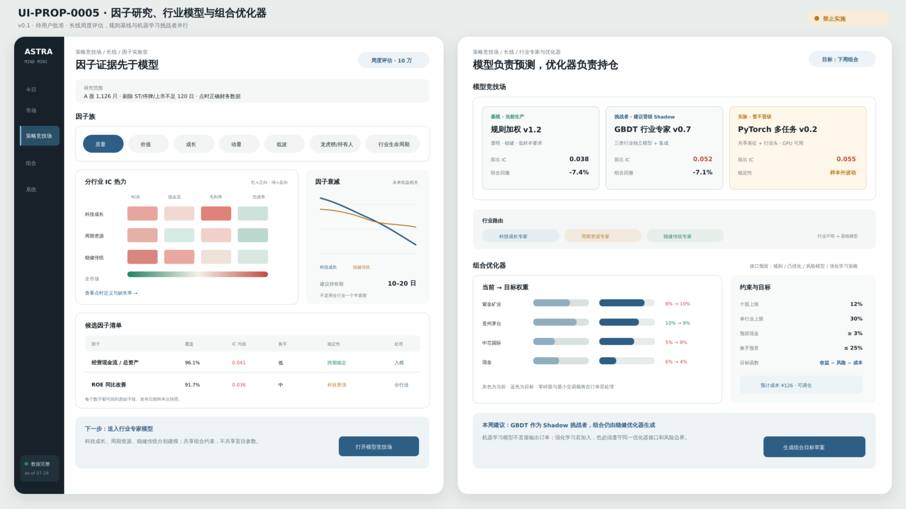

# UI-PROP-0005：长线因子、分行业模型与组合优化器

- 版本：0.1
- 状态：`superseded`
- 创建：2026-07-27
- 实现：阻断
- 替代原因：REQ-2026-0007 v2.0.0 已改为 F0/Alpha158/Alpha101、H20/H60 独立
  候选和唯一 CorePolicy；本版的分行业模型/通用优化器布局不再匹配批准行为

## 唯一任务

解释周度长线组合为何选择这些股票和权重，并让简单基线、行业模型与复杂挑战者在同一证据下比较。

## 示意图



[打开 SVG](./schematic-v0.1.svg)。

图中因子、模型、指标、权重和收益均为布局示意，不代表真实训练结果、研究结论或实盘资格。

本示意图只保留历史记录，不能作为实施依据。必须另行提交 v0.2 并取得用户对准确视觉
方案的明确批准。

## 核心选择

- 左侧画面是因子研究，右侧是模型与优化器比较。
- 因子按价值、质量、成长、动量、低波、流动性和上下文组织。
- 科技、周期、传统经济显示各自模型适用性和样本覆盖。
- 表格排序基线始终可见，GPU 模型只是挑战者。
- 目标权重同时显示“预测贡献、风险约束、成本与整数手”。

## 可见数据

- 因子覆盖、IC/RankIC、衰减、换手、单调性和相关性；
- 分行业有效性与缺失；
- 基线、梯度提升、PyTorch 多任务/专家模型；
- 样本外、成本后提升与不确定性；
- 优化器版本、约束、目标权重、现金和换手；
- 当前/目标权重差异与不可行原因；
- 周度评估时间和模型身份。

## 主要交互

- 选择因子家族和行业组；
- 对比模型；
- 查看特征与泄漏诊断；
- 比较优化器方案；
- 打开目标组合；
- 晋级长线策略版本。

## 必备状态

财务覆盖不足、行业样本不足、GPU 不可用、模型训练中、基线胜出、优化不可行、整数手导致偏差、无需调仓。

## 响应式

窄屏优先显示结论和目标权重；相关矩阵横向滚动；模型详情与约束进入底部检查器。

## 不在范围

直接编辑生产公式、把 AI 分数当成结论、无限制 RL、绕过周度节奏。

## 请确认

以下不是待确认项，而是 v0.2 必须覆盖的已批准行为：

1. H20/H60 分区展示准确 R0/B0、Ridge 和 LightGBM 决赛者。
2. 所有 eligible 候选可选；blocked 候选禁用并显示原因；默认 incumbent。
3. 显示 lineage 当前、最新和历史版本，以及 Promotion/Renewal/Fallback 决定类型。
4. 预览唯一 CorePolicy、H20/H60 固定贡献、最终持仓和现金。
5. 使用一次明确确认，不构建模型版本的跨周期笛卡尔选择或多层模态审批。

## 批准记录

```text
approved_version:
approved_by:
approved_at:
source_message:
```
