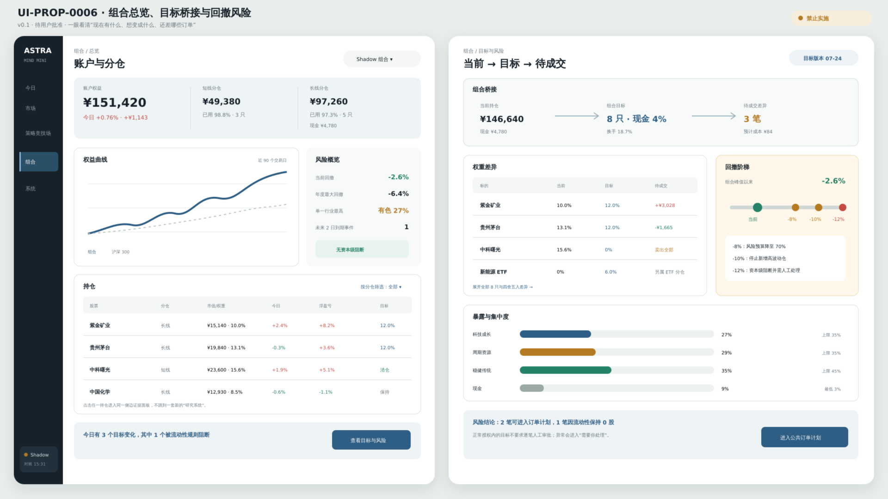

# UI-PROP-0006：组合总览、目标与风险

- 版本：0.1
- 状态：`awaiting_user_approval`
- 创建：2026-07-27
- 实现：阻断

## 唯一任务

解释资金现在在哪里、目标要去哪里、尚未执行什么，以及哪些风险会阻止变化。

## 示意图



[打开 SVG](./schematic-v0.1.svg)。

图中持仓、金额、收益、目标和风险状态均为布局示意，不代表真实账户或交易资格。

## 核心选择

- 使用“当前 → 目标 → 待执行”持仓桥作为页面记忆点。
- 短线、长线和账户总览清楚分层。
- 收益、现金、行业暴露、集中度和流动性共同解释。
- 8%/10%/12% 使用回撤阶梯和已记录动作，不使用无刻度仪表盘。
- 当前持仓、目标组合和订单计划永不混为一谈。

## 可见数据

- 两个分仓的资金、现金、持仓和收益；
- 当前/目标股数、权重和差额；
- 策略、股票、行业和分仓贡献；
- 行业、因子、流动性和集中度；
- 回撤位置、持续时间和控制动作；
- 待执行、未成交和对账差异；
- 组合目标、优化器和快照身份。

## 主要交互

- 切换账户/短线/长线；
- 选择持仓查看贡献和目标原因；
- 查看风险详情；
- 打开订单计划；
- 查看回撤处理记录。

## 必备状态

空账户、只有现金、目标未生成、目标陈旧、待执行、部分成交、对账差异、达到回撤级别、风险阻断。

## 响应式

窄屏先显示资金和回撤，再显示持仓桥；表格使用冻结股票列；风险检查器为底部面板。

## 不在范围

在组合页直接改策略参数、直接提交订单、把未执行目标显示为实际持仓。

## 请确认

1. “当前 → 目标 → 待执行”作为核心结构。
2. 短线、长线和账户总览可以一键切换。
3. 回撤用阶梯和动作解释，不用仪表盘。

## 批准记录

```text
approved_version:
approved_by:
approved_at:
source_message:
```
