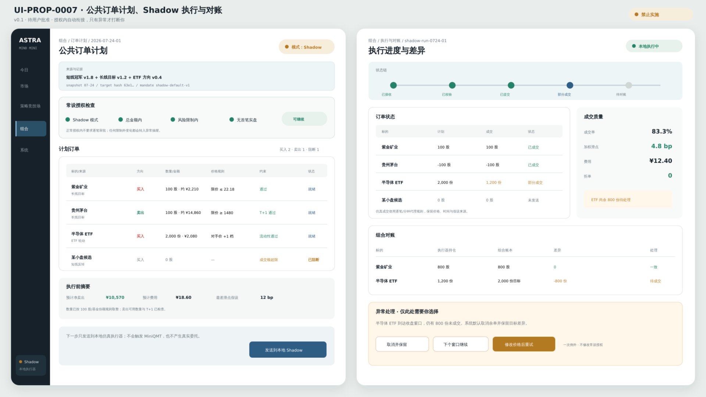

# UI-PROP-0007：订单计划、异常、执行与对账

- 版本：0.1
- 状态：`awaiting_user_approval`
- 创建：2026-07-27
- 实现：阻断

## 唯一任务

把目标组合转换成可理解、可恢复、可对账的订单计划，并只在超出常设授权或异常时要求人工介入。

## 示意图



[打开 SVG](./schematic-v0.1.svg)。

图中订单、价格、成交和对账状态均为布局示意；没有真实委托，也不代表 MiniQMT、Paper 或 Live 已授权。

## 核心选择

- 左侧画面解释订单计划，右侧画面解释执行和对账。
- 当前执行级别始终醒目：Shadow、Paper 或 Live。
- 常设授权内的正常计划显示“授权内，可继续”，不重复审批。
- 超金额、标的、时段、风险或数据异常进入统一异常抽屉。
- 每个订单显示目标来源、整数手调整、T+1、费用、流动性和拒绝原因。

## 可见数据

- 订单计划版本、目标组合和策略来源；
- 买卖、股数、限价/价格规则、预计金额与费用；
- 整数手、现金、T+1 和涨跌停处理；
- 常设授权匹配结果；
- 提交、确认、部分成交、成交、拒绝、撤单；
- 本地/券商持仓与现金差异；
- 重试、取消和恢复状态。

## 主要交互

- 发送到本地 Shadow；
- 在未来授权范围内继续 Paper/Live；
- 查看订单解释；
- 取消未提交计划；
- 重试可重试失败；
- 对异常批准一次、保持阻断或修改计划；
- 解决对账差异。

## 必备状态

计划为空、行情陈旧、T+1 不可卖、整数手不可行、涨跌停、停牌、超授权、连接断开、部分成交、重复提交阻断、对账差异。

## 响应式

窄屏按订单状态分组；计划汇总固定顶部；异常与对账进入全高底部面板。

## 不在范围

常设授权本身的最终参数、真实 MiniQMT 连接、默认开启 Live、逐单例行审批。

## 请确认

1. 正常授权内计划不重复审批。
2. Shadow/Paper/Live 使用同一工作面，但状态绝不混淆。
3. 异常和对账集中处理，不弹出多级模态框。

## 批准记录

```text
approved_version:
approved_by:
approved_at:
source_message:
```
