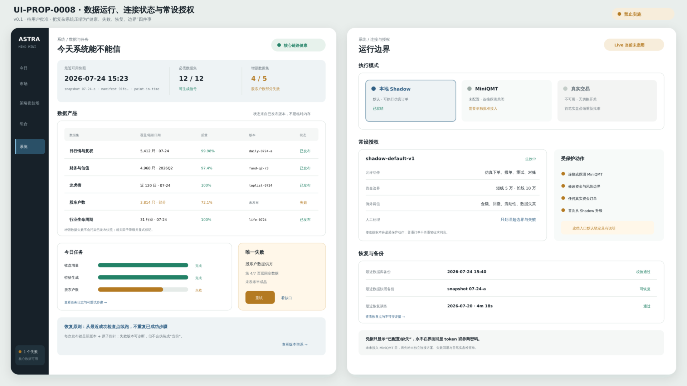

# UI-PROP-0008：系统、数据作业与执行设置

- 版本：0.1
- 状态：`awaiting_user_approval`
- 创建：2026-07-27
- 实现：阻断

## 唯一任务

让个人用户可以更新、检查和恢复本地系统，而不面对基础设施后台。

## 示意图



[打开 SVG](./schematic-v0.1.svg)。

图中数据覆盖、作业、备份和连接状态均为布局示意；没有读取或展示真实凭据，也没有连接 MiniQMT。

## 核心选择

- 左侧画面是数据与作业，右侧画面是执行连接、常设授权和恢复。
- 按“今天是否可用”组织数据健康，不按数据库表组织。
- 作业显示进度、当前步骤、预计剩余和失败原因。
- Shadow 默认可用；MiniQMT 只有在受保护检查点后才显示可连接动作。
- 不显示 Token、账户完整标识或原始密钥。

## 可见数据

- 行情、财务、龙虎榜、股东户数、行业、ETF 的截止时间与覆盖；
- 最近更新、下次计划和失败；
- 快照、模型与公式版本；
- 磁盘、备份和恢复点；
- Shadow 状态；
- MiniQMT 未配置/只读/Paper/Live；
- 常设授权摘要、到期和异常规则；
- 本地日志摘要和诊断导出。

## 主要交互

- 更新今日数据；
- 补齐指定缺口；
- 重试失败作业；
- 查看覆盖；
- 创建/验证备份；
- 启动本地 Shadow；
- 在未来明确授权后执行 MiniQMT 只读探查；
- 查看或修改常设授权。

## 必备状态

首次安装、无 Token、限流、部分响应、磁盘不足、作业运行中、作业失败、快照陈旧、Shadow 断开、MiniQMT 未配置、对账阻断。

## 响应式

窄屏用“数据 / 作业 / 执行 / 恢复”四个局部页签；当前严重阻断始终置顶。

## 不在范围

数据库 CRUD、日志全文浏览器、密钥明文、机构权限管理、第二套任务系统。

## 请确认

1. 系统页按用户任务而不是基础设施实体组织。
2. 数据健康与作业进度放在同一画面。
3. 执行连接、常设授权和备份恢复放在另一画面。

## 批准记录

```text
approved_version:
approved_by:
approved_at:
source_message:
```
