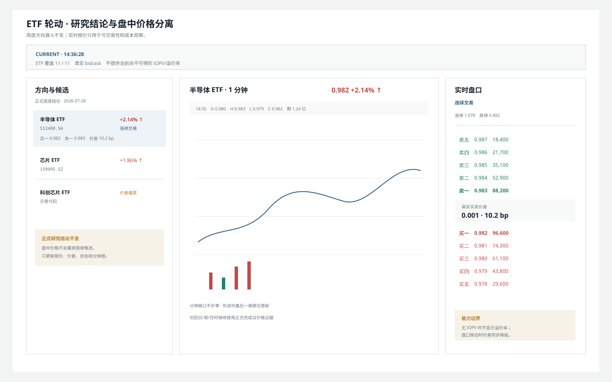
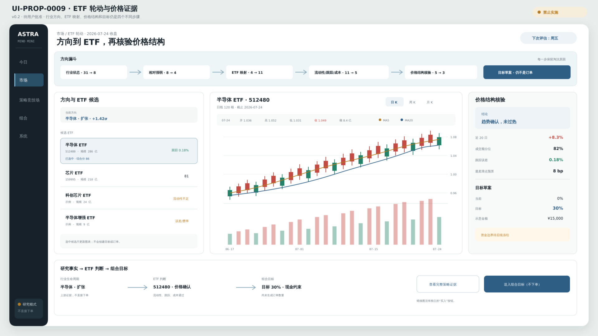
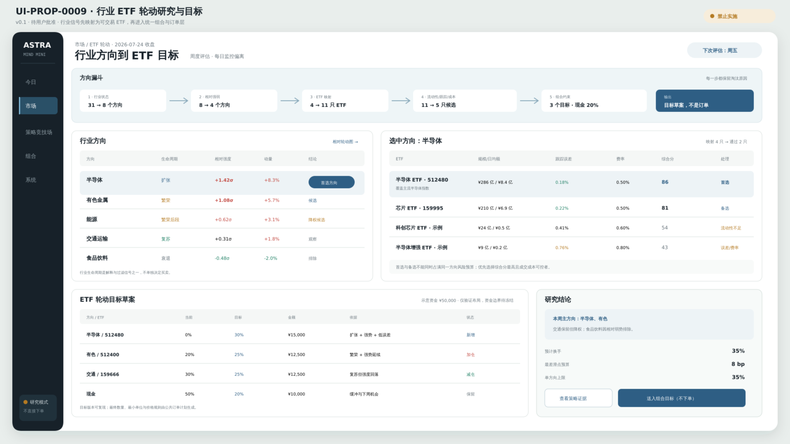

# UI-PROP-0009：ETF 轮动研究与目标

- 版本：0.3
- 状态：`approved`
- 创建：2026-07-27
- 更新：2026-07-30
- 实现：WP-0044 已按 v0.2 实现；v0.3 已批准，由 WP-0046 实施

## 唯一任务

解释哪些 ETF 方向通过当前轮动假设、哪些被拒绝、目标为何变化，以及成本后是否值得调仓。

## 示意图

### v0.3 ETF 实时价格与盘口覆盖评审稿



[打开 v0.3 SVG](./schematic-v0.3.svg)。

v0.3 不改变周度方向漏斗、候选分数、拒绝原因或目标草案，只在候选行加入当前价、
涨跌幅、交易状态和真实 bid/ask，在选中 ETF 后切换一分钟图与五档盘口。盘口价差
用于盘中可交易性观察，不回写正式流动性评分。

MiniQMT 当前不提供可信 IOPV，因此不显示或估算实时溢价率；只有未来独立数据能力
通过门禁后才能新增。分钟图与个股观察复用 ADR-0011 定义的
`Security Market Inspector` 行情内核和新鲜度语义；ETF 不进入包含股票行业、普通
企业估值和股东证据的 `Stock Workbench`。

状态区必须分别显示“决策截止日”“ETF 日线最新日期”和“MiniQMT 实时新鲜度”，
不得用一个“证据陈旧”概括三种口径。`mapping_tier:*` 等内部枚举不得直接暴露；
`theme_context` 显示为“主题相关 ETF，并非行业精确映射，只作背景参考”，其他代理
层级同样使用中文业务语义。

`UI-PROP-0009 v0.3` 已获批准。窄屏先显示候选与状态，再显示分钟图和盘口；所有区域
只读，无追涨、调仓或订单动作。

### v0.2 ETF 候选蜡烛图



[打开 v0.2 SVG](./schematic-v0.2.svg)。

### v0.1 方向漏斗与目标



[打开 v0.1 SVG](./schematic-v0.1.svg)。

0.2 在方向漏斗和目标之间增加所选 ETF 的价格结构核验。图中行业、ETF、金额、指标、蜡烛和目标均为布局示意，不代表真实行情、研究结论或订单。

## 核心选择

- 页面位于“市场 → ETF 轮动”，但策略证据和目标组合仍通过公共契约。
- 使用“方向漏斗”展示行业状态、相对强弱、ETF 映射、流动性、跟踪和成本。
- 行业相对轮动只是一个上游证据，不直接产生 ETF 订单。
- 首案按周调仓，日度只检查风险与可交易性。
- 目标变化与拒绝原因同等重要。
- 选择 ETF 后在同页显示日/周/月蜡烛、成交量、均线与流动性，不跳到独立行情系统。
- 蜡烛图没有买入按钮，只能进入策略证据或组合目标。
- 图表底部使用双端时间范围轴，并通过悬浮十字线显示该根 K 线的完整数据。

## 可见数据

- 行业方向、生命周期、相对轮动和置信度；
- 候选 ETF、规模、成交额、价差、跟踪与映射覆盖；
- 当前/目标权重、现金、换手和预计成本；
- 选择、保留、降权和拒绝原因；
- 周度调仓日期和日度风险状态；
- ETF 策略版本、快照和已知限制。
- 所选 ETF 的 OHLCV、MA5/MA20、时间范围、成交额分位和跟踪误差；
- 价格结构核验结论及其证据截止时间。

## 主要交互

- 切换研究/目标模式；
- 选择行业方向；
- 查看 ETF 映射与跟踪；
- 比较候选；
- 切换日/周/月 K，拖动底部双端范围轴缩放或平移价格与成交量窗口；
- 鼠标悬浮蜡烛或成交量，读取该根 K 线的完整数据；
- 查看目标变化；
- 打开 ETF 策略证据；
- 进入公共订单计划。

## 必备状态

无合格方向、ETF 映射缺失、行情缺失或陈旧、流动性不足、跟踪异常、停牌、无需调仓、目标已生成但未执行、策略未晋级。

## 响应式

窄屏先显示方向漏斗和本周结论；候选表横向滚动；目标检查器为底部面板。

## 不在范围

把行业图直接变成订单、分钟级轮动、盘中追涨、自动晋级、绕过组合风险。

## 请确认

1. “方向漏斗”作为页面记忆点。
2. 研究证据与目标权重同屏，但保持概念分离。
3. ETF 订单继续进入公共订单计划，不另造执行页。
4. ETF 候选与蜡烛图联动，但图表本身不提供交易动作。

## 批准记录

```text
approved_version: 0.3
approved_by: user
approved_at: 2026-07-29
source_message: "批准 UI-PROP-0001 v0.5、UI-PROP-0002 v0.8、UI-PROP-0009 v0.3、UI-PROP-0011 v0.2，并继续实施"
```

0.2 已成为 ETF 轮动研究、价格核验与目标草案的视觉基线，并由 WP-0044 实现。该批准
不授权 ETF 策略晋级、订单、MiniQMT 或 Live；浏览器截图受外部策略阻断，不伪造为
视觉验收通过。
