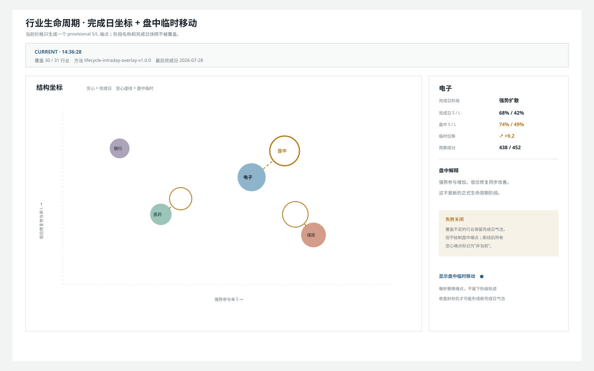
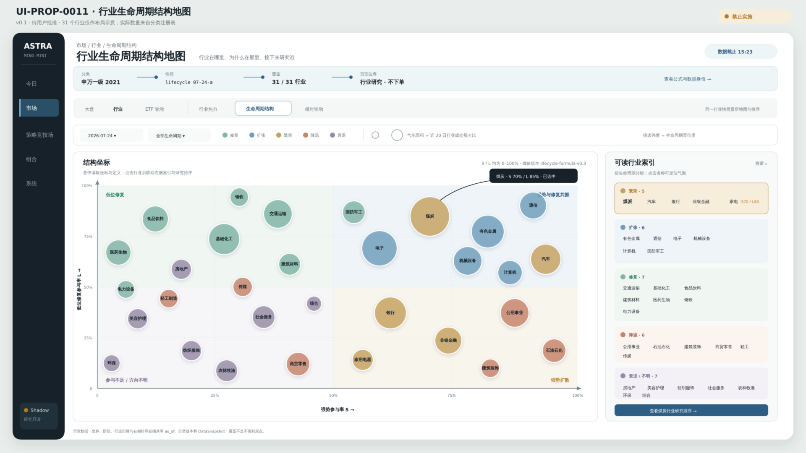
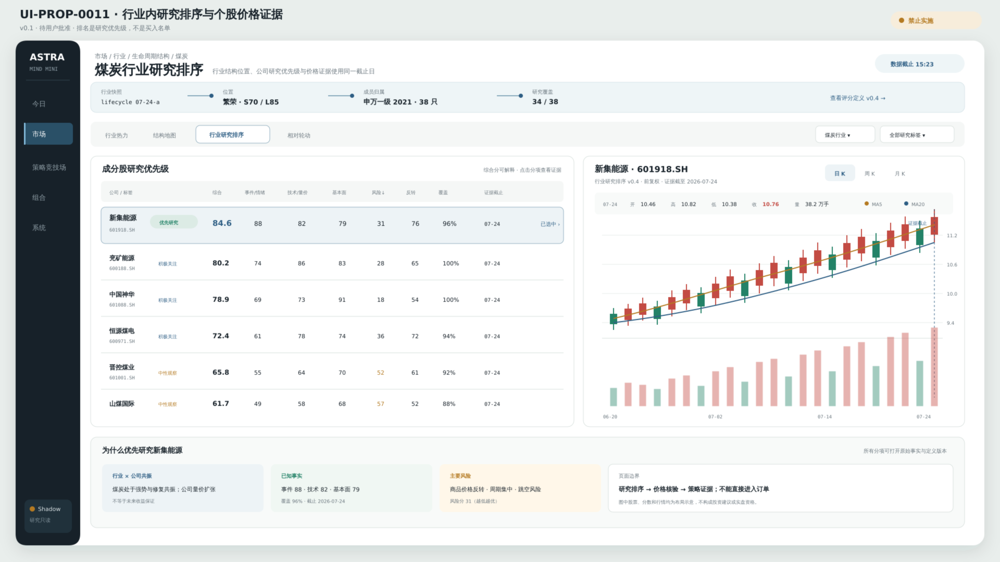

# UI-PROP-0011：行业生命周期结构地图与行业内研究排序

- 版本：0.2
- 状态：`approved`
- 创建：2026-07-27
- 更新：2026-07-30
- 对应需求：[REQ-2026-0003 v1.1.2](../../../requirements/REQ-2026-0003-complete-interface-schematics.md)
- 实现：v0.1 已由 WP-0040/WP-0042 完成；v0.2 已批准，由 WP-0046 实施

## 参考输入

用户提供了两张界面参考图：

1. 全行业结构气泡地图，右侧提供可读行业索引；
2. 行业内股票研究排序，选择股票后在右侧联动蜡烛图。

本提案复用信息关系，不逐像素复制参考图、第三方代码或未解释公式。

## 唯一任务

回答两个连续问题：

1. 当前各行业在生命周期结构中的位置是什么？
2. 选定一个行业后，哪些成分股最值得优先研究，价格证据是否支持继续研究？

它属于“市场 → 行业 → 生命周期结构”，是只读研究工作面，不直接产生组合目标或订单。

## 示意图

### v0.2 盘中临时生命周期移动评审稿



[打开 v0.2 SVG](./structure-map-v0.2.svg)。

v0.2 保留完成日实心气泡、阶段、面积和置信度，只用赭石虚线连接一个空心“盘中
临时端点”。端点使用 `lifecycle-intraday-overlay-v1.0.0`：以最近完成日历史为锚，
仅用当前会话价格替换当日末值，重算临时强势参与率 `S` 和低位修复参与率 `L`。
正式阶段名称不随盘中端点改变；收盘封存与日线对账完成后才可能发布新气泡。

每秒只替换端点，不保存秒级移动轨迹。覆盖不足的行业保留完成日气泡但不画临时端点；
断线后端点标记“非当前”。窄屏优先显示选中行业完成日/盘中坐标，再显示地图。

`UI-PROP-0011 v0.2` 已获批准。本版本不改变 v0.1 的正式生命周期公式或研究排序。

### 行业结构地图



[打开结构地图 SVG](./structure-map-v0.1.svg)。

### 行业内研究排序



[打开研究排序 SVG](./industry-ranking-v0.1.svg)。

图中行业、股票、分数、蜡烛和状态均为布局示意，不代表真实行情、研究结论、投资决定或实盘资格。

## 核心选择

- 行业页局部模式扩展为“行业热力 / 生命周期结构 / 相对轮动”，不增加一级导航。
- 结构地图的横轴、纵轴、气泡大小、颜色与描边各自只表达一个可解释变量。
- 地图标签优先保留选中行业、极值和近期迁移行业；右侧可读索引保证其余行业可定位。
- 选择行业后进入同页研究排序，不打开新的后台系统。
- 排序标签使用“优先研究 / 积极关注 / 中性观察”，避免把研究证据提前包装成投资决定。
- 选择股票后更新右侧统一蜡烛图检查器；图表没有下单按钮。
- 联动蜡烛图底部使用双端时间范围轴，并通过悬浮十字线显示该根 K 线的完整数据。

### 通用个股工作面收敛（WP-0048 规划）

当前 `IndustryRankingPanel` 内联个股蜡烛图属于兼容实现。收敛后，排序表仍保留名称、
研究标签、关键分项、最新价和涨跌等紧凑摘要；选择股票创建带生命周期快照、行业、
排序、筛选和滚动位置的 `Stock Inspection Focus`，进入 UI-PROP-0001 v0.6 的通用
个股工作面，不再由生命周期页面维护完整 K 线、指标或盘口。

返回时必须恢复所选行业、排序、筛选和滚动位置。通用工作面只读取本页面提供的类型化
行业/排序上下文，不能把研究优先级写入行情事实或转换为组合目标和订单。

## 结构地图建议口径

首案建议，最终阈值在阶段 6 以版本化公式冻结：

- 横轴 `S`：强势参与率，衡量行业成分中趋势与相对强度同时为正的覆盖比例；
- 纵轴 `L`：低位修复参与率，衡量处于较低价格位置且相对强度正在改善的覆盖比例；
- 气泡面积：行业近 20 日成交额占比；
- 颜色：生命周期阶段；
- 描边：生命周期置信度；
- 坐标、阶段与排名使用同一个 `IndustryLifecycleSnapshot` 和 `DataSnapshot`。

行业数量来自分类注册表。界面中的“31 个行业”只是示意，不能成为代码常量。

## 行业内研究排序

排序至少显示：

- 综合研究优先级；
- 事件/情绪；
- 技术/量价；
- 基本面；
- 风险；
- 反转/修复；
- 数据覆盖率；
- 研究标签与证据截止时间。

每个分项必须能追溯到定义版本。综合分可以使用规则或模型，但不能只显示无法解释的 AI 分数。

## 主要交互

- 选择行业分类版本与日期；
- 按生命周期阶段筛选；
- 搜索、悬停或点击行业气泡；
- 通过右侧索引定位重叠行业；
- 打开选中行业的研究排序；
- 按研究标签筛选和排序；
- 选择股票更新蜡烛图；
- 切换日/周/月 K，拖动底部双端范围轴缩放或平移价格与成交量窗口；
- 鼠标悬浮蜡烛或成交量，读取该根 K 线的完整数据；
- 打开分项证据与数据身份。

## 必备状态

行业注册表缺失、历史归属不足、生命周期快照缺失、部分行业覆盖不足、公式版本不一致、地图标签拥挤、行业无合格成分、排序计算中、分项覆盖不足、个股行情陈旧、复权口径未知、数据损坏。

覆盖不足时保留行业身份并显示不可用原因，不把缺失行业放到坐标原点。

## 响应式

- 窄屏先显示选中行业结论和结构位置；
- 结构地图保持最小可读宽度并允许受控横向查看；
- 可读索引变为底部面板；
- 排序表固定股票与研究标签列，其余列横向滚动；
- 个股蜡烛图成为排序表下方的全宽区域。

## 不在范围

- 写死 56 行业；
- 直接沿用旧项目未验证公式；
- 从气泡或研究排名直接买入；
- 分钟级行情；
- 自动晋级个股策略；
- 独立“行业生命周期”一级导航；
- 把结构地图与资金相对轮动混成一张不可解释图。

## 请确认

1. 行业局部模式变为“行业热力 / 生命周期结构 / 相对轮动”。
2. 结构地图采用气泡图加右侧可读索引。
3. 研究排序使用“优先研究”等标签，而不是直接显示“买入候选”。
4. 选择股票后同页联动蜡烛图，且没有交易按钮。
5. 结构地图和研究排序使用同一个 `as_of`、行业归属版本和数据快照。

## 批准记录

```text
approved_version: 0.2
approved_by: user
approved_at: 2026-07-29
source_message: "批准 UI-PROP-0001 v0.5、UI-PROP-0002 v0.8、UI-PROP-0009 v0.3、UI-PROP-0011 v0.2，并继续实施"
```

0.1 已成为行业生命周期结构地图、行业内研究排序与联动个股价格核验的视觉基线。
WP-0040 已实现结构地图与可读行业索引；WP-0042 已实现行业内研究排序、同页日/周/月
价格证据、双端范围轴和逐 K 悬浮，并分别以正式桌面/窄屏截图完成对照。该批准不把
研究排序转化为买入决定、组合目标或订单。
