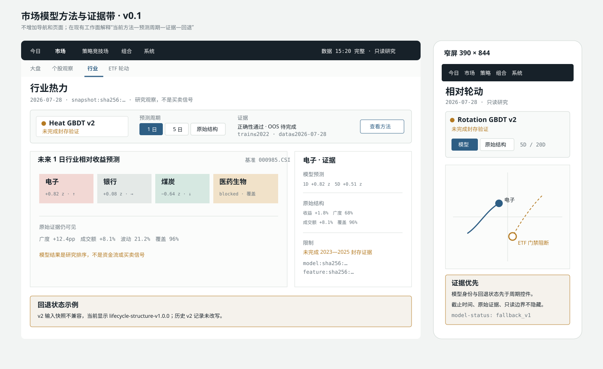

# UI-PROP-0012：市场模型方法与证据带

- 版本：0.1
- 状态：`approved`
- 创建：2026-07-29
- 对应需求：REQ-2026-0002 v1.9.0、REQ-2026-0008 v2.0.0
- 实现：WP-0056 已实施并完成浏览器验收

## 页面与唯一任务

本提案不新增页面。它为“市场 → 行业热力 / 生命周期结构 / 相对轮动 / ETF 轮动”
现有工作面增加一条统一的“方法与证据带”，唯一任务是回答：

> 当前看到的是哪个预测周期和准确模型，它是否经过支持性证据，若已回退，原始结构
> 证据和回退原因在哪里？

页面仍是只读市场研究，不产生策略晋级、组合目标或订单。

## 视觉方向

沿用“安静的量化交易桌面”，把方法状态做成一条贴近主画布的纸质索引带：石墨正文、
聚焦蓝表示当前选择、赭石表示未验证/证据不足、灰色表示 v1 回退。它是证据导航，不是
模型控制台，也不使用巨型 KPI、发光状态或卡片套卡片。

## 示意图



[打开 v0.1 SVG 原图](./schematic-v0.1.svg)。

示意数据只用于确认布局，不代表真实预测、模型证据或投资结论。

## 固定信息层级

1. 既有顶部五入口、市场二级导航和页面标题完全不变；
2. 方法与证据带位于页面标题/截止时间之后、主画布之前；
3. 左侧显示当前方法身份和状态；中部选择预测周期或“原始结构”；右侧显示证据等级、
   训练截止、数据截止和“查看方法”；
4. 主画布默认显示当前激活方法；选择“原始结构”只切换本地已加载投影，不重新拉取
   提供方；
5. 右侧检查器同时列出模型预测、关键原始分项、覆盖、已知缺口和回退原因；
6. `unvalidated` 永远使用赭石“未完成封存验证”，不能显示为已支持或健康绿色。

## 各工作面可见数据

| 工作面 | 默认模型结果 | 保留的原始证据 |
| --- | --- | --- |
| 行业热力 | 未来 1 日 / 5 日相对中证全指预测，可切周期 | 收益、广度、成交额、波动、覆盖 |
| 生命周期 | 学习阶段、概率和置信度 | `S`、`L`、5 日变化、20 日峰值/回撤、成交额占比 |
| 相对轮动 | 未来 5 日相对趋势与 20 日相对动量预测 | v1 raw z、逻辑象限、确认事件和历史尾迹 |
| 行业内排序 | 未来 20/60 日行业内相对研究优先级 | 事件、趋势、财务质量、估值、风险、缺失状态 |
| ETF 轮动 | 未来 20 日成本后超额、门禁与研究目标草案 | 生命周期、强弱、价格结构、流动性、真实价差、跟踪误差 |

相对轮动模型坐标的显示层使用有界 tanh，但公式抽屉必须显示未裁剪预测 z；逻辑不因
画布边界截断。ETF 目标仍是只读 `EtfTargetDraft`，不得改名为公共组合目标。

## 主要动作

- 切换预测周期；
- 在“模型结果 / 原始结构”间切换；
- 打开方法、训练窗口、证据与回退原因；
- 刷新失败区域；
- 保持既有行业、证券、日期、播放和返回状态。

没有“激活模型”“晋级”“调仓”“买入”“卖出”或“下单”动作。模型只读激活由
后台证据流程产生，页面只解释其结果。

## 必备状态

- **Loading**：保持主画布尺寸，证据带显示“读取模型身份/预测/证据”真实阶段；
- **Empty**：没有该截止日预测，原始 v1 可用时显示可切换入口；
- **Stale**：显示模型训练截止和数据截止分别落后多少；
- **Blocked**：输入快照、成员点时、官方基准、NAV 或真实价差门禁不满足；
- **Error**：模型产物或内容哈希损坏，显示错误身份与恢复入口；
- **Disconnected**：只用于依赖当前 MiniQMT 会话的真实价差；完成日模型仍可读；
- **Unvalidated**：正确性已通过但封存证据未完成，赭石明确标记；
- **Fallback**：当前显示准确 v1，列出 v2 失败原因和最近一次有效身份。

未知、未验证、陈旧和回退均不得使用健康绿色。

## 响应式

- 1440px 桌面：证据带单行；方法、周期、证据和截止时间按四列对齐；
- 窄屏：证据带在标题下分两行，第一行保留方法/状态，第二行横向滚动周期和原始结构；
- 证据摘要进入主画布前，不隐藏截止时间、只读声明或回退状态；
- 表格继续由既有工作面受控横向滚动，不新增页面级水平溢出。

## 明确不做

- 新一级/二级导航、新页面或模型管理后台；
- 用模型分数替换全部原始分项；
- 隐藏 v1 历史、证据缺口或 `unvalidated`；
- 在页面修改模型超参数或激活指针；
- 自动策略晋级、公共组合目标、订单或 MiniQMT 账户动作。

## 待确认

1. 方法与证据带保持一条安静横带，不另建模型页；
2. 默认显示当前激活模型，原始结构始终一键可见；
3. 未验证用赭石明确标记，证据不支持时自动显示准确 v1；
4. ETF 门禁未满足时保留漏斗和原始证据，但不显示可执行资格；
5. 窄屏把模型身份与回退状态放在周期控件之前。

## 批准记录

```text
approved_version: v0.1
approved_by: user
approved_at: 2026-07-29
source_message: 批准 UI-PROP-0012 v0.1
```

需求和实施总计划的批准不自动等于本视觉版本批准。只有用户明确批准
`UI-PROP-0012 v0.1` 后，后续 UI 工作包才能修改 React/CSS/路由。

## 实现截图与对照

- [1440×1000 桌面实际截图](./actual-desktop-1440x1000.png)
- [390×844 窄屏实际截图](./actual-mobile-390x844.png)

对照结论：

- 桌面保持单行身份、周期、证据与方法入口，展开详情仍在同一索引带内；
- 窄屏先显示方法身份和回退状态，再显示可横向阅读的周期与原始结构；
- 示意图使用 `unvalidated_v2` 演示布局，实际生产状态准确显示 `fallback_v1`、
  `v2_not_trained` 和规则式训练截止“不适用”，没有用演示预测填充；
- 沿用既有页面标题、实时状态条和主画布，不新增导航、页面或交易动作。
