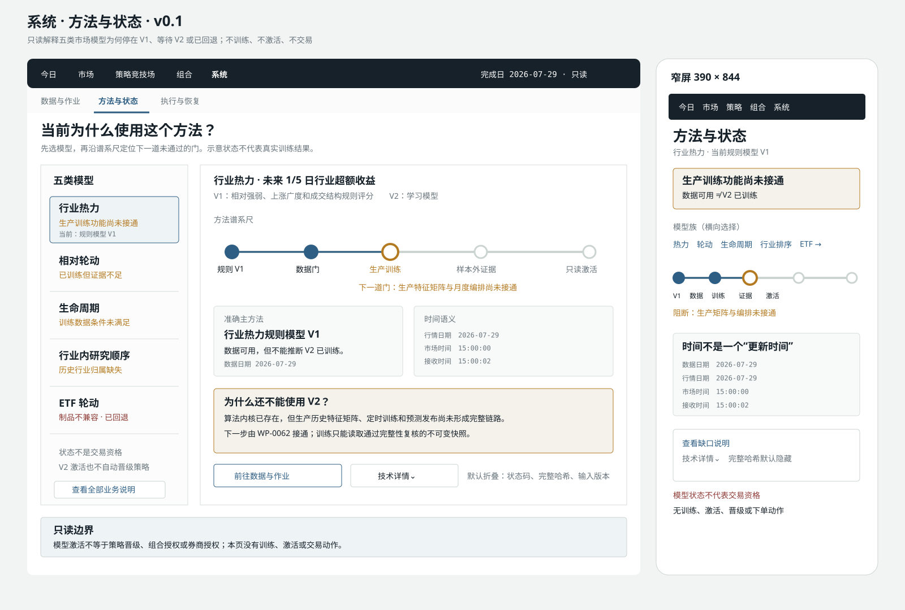

# UI-PROP-0013：系统“方法与状态”

- 版本：0.1
- 状态：`approved`
- 创建：2026-07-30
- 对应需求：REQ-2026-0003 v1.8.0、REQ-2026-0008 v2.2.0
- 对应工作包：WP-0061
- 实现状态：已由 [WP-0063](../../../planning/work-packages/WP-0063-method-status-page-implementation.md)
  完成 React、CSS、路由和浏览器验收；实际对照截图见
  [桌面 1440px](./actual-desktop-1440x1000.png) 与
  [窄屏 390px](./actual-mobile-390x844.png)。

## 页面与唯一任务

本提案在既有“系统”一级入口内增加“方法与状态”二级页面，唯一任务是回答：

> 五类市场研究当前使用 V1 还是 V2，为什么，以及下一道尚未通过的数据、训练、证据
> 或激活门是什么？

页面只解释已发布事实，不训练模型、不修改激活指针、不晋级策略，也不产生组合目标、
订单或券商授权。

## 视觉方向

沿用“安静的量化交易桌面”。页面的记忆点是**方法谱系尺**：每个模型族沿
“规则 V1 → 数据门 → 生产训练 → 样本外证据 → 只读激活”横向展开，当前位置和阻断
原因一眼可见。它表达真实生命周期，不是装饰性步骤条。

色彩和字体沿用全局规范：

- 画布灰 `#F2F4F3`、工作面白 `#FFFFFF`、石墨黑 `#172129`；
- 聚焦蓝 `#2E5E84` 表示当前选择或已形成的中性事实；
- 注意赭石 `#B47A22` 表示待训练、数据不足、证据不足或等待激活；
- 深风险红 `#8E3B36` 表示制品损坏或版本不兼容；
- 灰色表示准确 V1 回退或不适用，未知状态不使用绿色；
- 中文使用 `Noto Sans SC`，数据与技术身份使用 `IBM Plex Mono`。

## 示意图



[打开 v0.1 SVG 原图](./schematic-v0.1.svg)。

图中的日期、模型状态和缺口均为布局示意，不代表真实训练结果或实盘资格。

## 固定信息层级

1. 顶部仍只有“今日 / 市场 / 策略竞技场 / 组合 / 系统”五个一级入口；
2. System 二级导航包含既有“数据与作业 / 执行与恢复”，以及本提案的“方法与状态”；
3. 首层显示五类模型的当前业务状态、准确主方法和最近完成日；
4. 选择一个模型后，方法谱系尺显示它通过和未通过的准确门；
5. 第二层解释 V1/V2 定义、预测目标、训练/数据截止和回退原因；
6. 原始枚举、完整哈希、制品路径和输入版本只进入默认折叠的“技术详情”；
7. 页尾持续显示“模型激活不等于策略晋级、组合授权或券商授权”。

## 五类模型可见内容

| 模型族 | V1 业务解释 | V2 预测目标 |
| --- | --- | --- |
| 行业热力 | 相对强弱、上涨广度和成交结构规则评分 | 未来 1/5 日行业超额收益 |
| 相对轮动 | 相对强度、动量变化和象限规则 | 未来 5/20 日行业超额收益 |
| 生命周期 | 按趋势、位置和参与度划分六阶段 | 六阶段概率和置信度 |
| 行业内研究顺序 | 质量、动量、结构和风险固定权重排序 | 未来 20/60 日行业内相对收益 |
| ETF 轮动 | 收益、风险、流动性和价差规则漏斗 | 成本后未来 20 日官方基准超额 |

## 状态业务文案

| 内部状态 | 主界面业务文案 | 用户应理解的含义 |
| --- | --- | --- |
| `production_pipeline_unavailable` | 生产训练功能尚未接通 | 算法内核存在，但生产矩阵、编排或发布链尚未完整形成 |
| `training_data_blocked` | 训练数据条件未满足 | 点时成员、完整历史、官方基准或真实价差仍缺失 |
| `trained_evidence_insufficient` | 已训练但证据不足 | 已有制品，但样本外证据尚不足以支持 V2 |
| `validated_pending_activation` | 已通过验证，等待激活 | 证据门已通过，准确只读激活尚未发生 |
| `active` | 学习模型已激活 | 页面可以准确 V2 为主要结果，同时保留 V1 原始结构 |
| `artifact_incompatible` | 模型制品不可用，已回退规则模型 | 制品损坏或输入版本不兼容，失败关闭并使用准确 V1 |

“数据可用”是输入数据状态，不单独冒充模型已训练或已激活。

## 时间语义

- **数据日期**：不可变输入快照覆盖到的最后市场日期；
- **行情日期**：价格序列对应的最后交易日；
- **市场时间**：行情提供方声明的成交或快照时刻；
- **接收时间**：本地系统收到该记录的时间；
- **训练截止**：该模型训练样本允许使用的最后可用日期；
- **证据截止**：样本外比较已经完成到的最后标签日期。

不同时间并列显示，不用单一“更新时间”掩盖其差异。

## 常见缺口的业务解释

- 缺少当时可知的历史行业归属：暂不能进行严格历史验证；
- ETF 上市以来行情未补齐：暂不能形成完整训练窗口；
- 官方基准映射不完整：暂不能评价真实基准超额；
- 真实价差不足 60 个交易日：暂不能形成成本后支持性证据；
- 快照完整性未通过：不得进入正式 V2 训练；
- 制品哈希或输入版本不兼容：停止使用该 V2，并回退准确 V1。

页面不建议伪造、倒灌或放宽数据门。

## 主要动作

- 选择五类模型之一；
- 查看 V1/V2 定义、预测目标和当前谱系位置；
- 展开业务缺口说明；
- 展开只读“技术详情”；
- 前往“数据与作业”查看可恢复的数据问题；
- 刷新失败区域。

没有“立即训练”“强制激活”“晋级策略”“下单”或券商连接动作。

## 必备状态

- **Loading**：保留模型列表和谱系尺布局，显示正在读取的方法、证据或数据门；
- **Empty**：尚未登记该模型族，说明需要先建立哪类生产身份；
- **Stale**：分别显示数据、训练或证据截止落后，不笼统写“模型陈旧”；
- **Blocked**：业务说明准确数据门，提供前往数据作业的只读入口；
- **Disconnected**：仅影响依赖实时会话的证据，完成日方法状态仍可查看；
- **Error**：制品或状态投影损坏，显示回退结果和恢复入口；
- **Fallback**：明确当前使用准确 V1，并解释 V2 未被采用的原因；
- **Active**：说明 V2 已激活，但不使用“可交易”或“已晋级”措辞。

未知、缺失、阻断、等待和回退均不得显示绿色健康。

## 响应式

- 1440px 桌面：左侧为五类模型索引，右侧为方法谱系尺与解释面板；
- 1024px：模型索引压缩为单行可横向选择，谱系尺保持完整标签；
- 390px 窄屏：先显示模型、当前方法和阻断摘要，再显示可横向滚动的谱系尺；
- 窄屏的技术详情位于页面底部折叠区，不把完整哈希挤入主状态；
- 所有尺寸都保留准确截止、回退状态和只读边界。

## 明确不做

- 第六个一级导航或独立“AI 中心”；
- 模型 CRUD、在线超参数编辑或训练控制台；
- 用单一“V2 尚未训练”覆盖不同根因；
- 用模拟预测填充缺失 V2；
- 绕过 WP-0057 快照完整性门或各模型数据门；
- 策略 Promotion/Renewal/Fallback、`PortfolioTarget`、`OrderPlan`；
- MiniQMT、Paper、Live 或真实资金动作。

## 已确认视觉决策

1. 采用“左侧五类模型索引 + 右侧方法谱系尺”的桌面结构；
2. System 二级页名称使用“方法与状态”，不新建一级入口；
3. 主界面只显示业务文案，原始技术码进入默认折叠详情；
4. 阻断状态提供“查看数据作业”，但不在本页直接训练或修复；
5. 窄屏允许横向滚动谱系尺，优先保留当前方法、阻断原因和日期。

## 批准记录

```text
approved_version: 0.1
approved_by: user
approved_at: 2026-07-30
source_message: “批准UI-PROP-0013，编排并派发下一批并行工程包”
```

本次批准准确覆盖 UI-PROP-0013 v0.1，并授权另立 WP-0063 实施页面。它不授权模型
训练、模型激活、策略晋级、生产数据变更、MiniQMT、Paper、Live 或订单。
